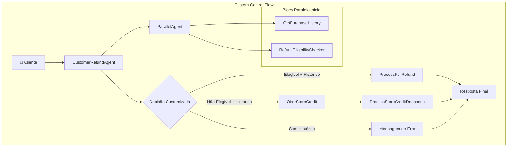
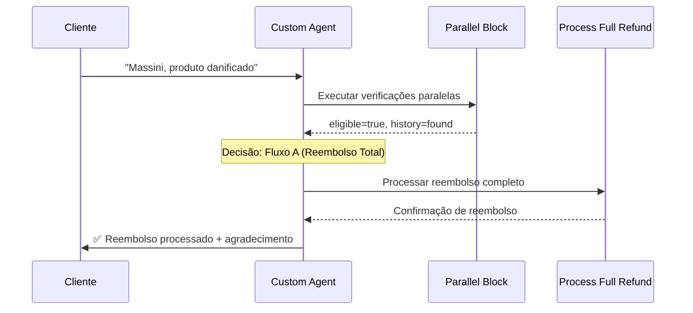
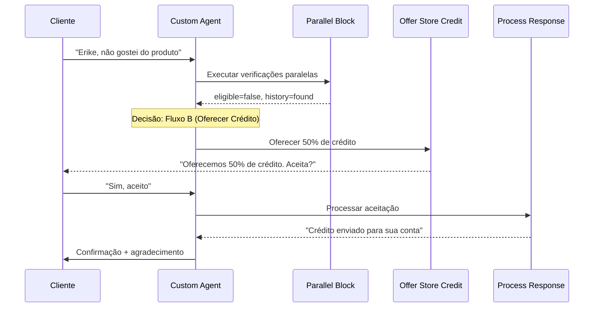
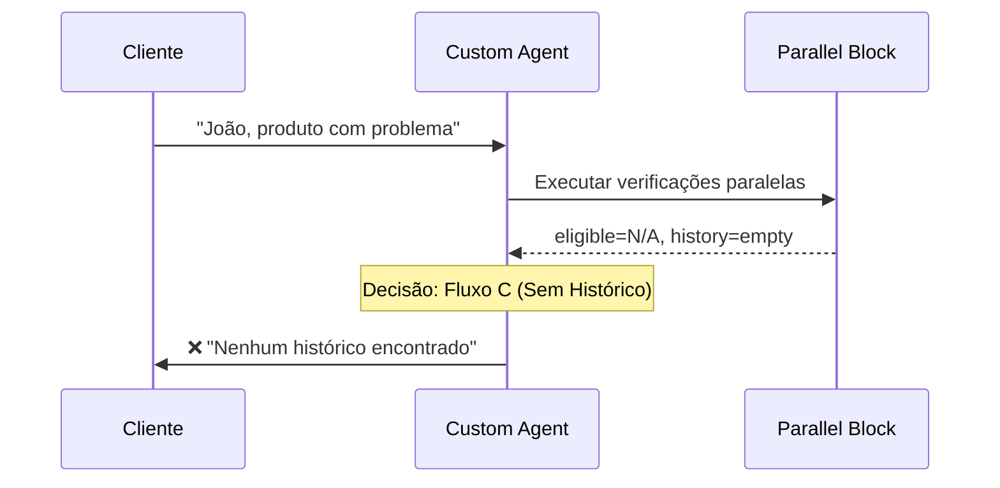

# Custom Control Flow - Sistema de Reembolso Natura

## 📋 Visão Geral

O padrão Custom Control Flow implementa **lógica de orquestração personalizada** usando a classe `BaseAgent`. Permite controle total sobre o fluxo de execução, decisões condicionais complexas e tratamento de casos especiais como oferta de crédito na loja.

## 🏗️ Arquitetura



## 🔧 Implementação

### Classe Principal Customizada

```python
class CustomerRefundAgent(BaseAgent):
    """Agente com controle de fluxo personalizado"""
    
    def __init__(self, name: str, **sub_agents):
        # Configura agentes paralelos e sequenciais
        parallel_agent = ParallelAgent(
            name="RefundChecks",
            sub_agents=[refund_eligibility_checker, get_purchase_history],
        )
        
        super().__init__(
            name=name,
            sub_agents=[parallel_agent, offer_store_credit, process_store_credit_response],
            **sub_agents
        )

    @override
    async def _run_async_impl(self, ctx: InvocationContext) -> AsyncGenerator[Event, None]:
        """Implementa lógica de orquestração personalizada"""
        
        # 1. Execução paralela inicial
        async for event in self.parallel_agent.run_async(ctx):
            yield event
        
        # 2. Análise dos resultados e decisão customizada
        is_eligible = ctx.session.state.get("is_refund_eligible", "false")
        purchase_history = ctx.session.state.get("purchase_history", [])
        
        # 3. Lógica condicional complexa
        if is_eligible and purchase_history:
            # Fluxo A: Reembolso total
            await self._process_full_refund(ctx)
        elif purchase_history and not is_eligible:
            # Fluxo B: Oferecer crédito na loja
            await self._offer_store_credit_flow(ctx)
        else:
            # Fluxo C: Sem histórico
            await self._handle_no_history(ctx)
```

### Sub-Agentes Especializados

#### 1. Agentes Paralelos Iniciais
```python
get_purchase_history = LlmAgent(
    name="GetPurchaseHistory",
    model=GEMINI_MODEL,
    instruction=purchase_history_subagent_prompt,
    tools=[get_purchase_history],
    output_key="purchase_history",
)

refund_eligibility_checker = LlmAgent(
    name="IsRefundEligible", 
    model=GEMINI_MODEL,
    instruction=check_eligibility_subagent_prompt_parallel,
    tools=[check_refund_eligibility],
    output_key="is_refund_eligible",
)
```

#### 2. Agente de Reembolso Total
```python
process_full_refund = LlmAgent(
    name="RefundProcessorAgent",
    model=GEMINI_MODEL,
    instruction=process_refund_subagent_prompt,
    tools=[process_refund],
    output_key="refund_confirmation_message",
)
```

#### 3. Agente de Oferta de Crédito
```python
offer_store_credit = LlmAgent(
    name="OfferStoreCredit",
    model=GEMINI_MODEL,
    instruction="""
    The customer is not eligible for a refund but has a valid purchase history. 
    Politely explain this and offer them a 50% store credit for their next purchase as an alternative. 
    Be empathetic and professional. Ask if they would like to accept this offer.
    """,
    output_key="store_credit_offer",
)
```

#### 4. Agente de Processamento de Resposta
```python
process_store_credit_response = LlmAgent(
    name="ProcessStoreCreditResponse",
    model=GEMINI_MODEL,
    instruction="""
    You are processing the customer's response to the store credit offer.
    Based on the customer's response:
    - If they accept: Output "I'll send this to your account. Thanks!"
    - If they decline: Output "I apologize that we couldn't accommodate your request. Thank you for your understanding."
    """,
    output_key="final_response",
)
```

## 🔄 Fluxos de Execução Customizados

### Fluxo A: Reembolso Total (Cliente Elegível)



### Fluxo B: Crédito na Loja (Cliente Não Elegível)



### Fluxo C: Sem Histórico



## ✅ Vantagens

- **Controle total**: Lógica de decisão completamente customizada
- **Flexibilidade máxima**: Pode implementar qualquer fluxo condicional
- **Tratamento de casos especiais**: Como oferta de crédito na loja
- **Performance otimizada**: Combina paralelismo com decisões condicionais
- **Extensibilidade**: Fácil adicionar novos fluxos
- **Estado compartilhado**: Agentes compartilham contexto da sessão

## ❌ Desvantagens

- **Complexidade alta**: Requer conhecimento profundo do framework
- **Mais código**: Implementação manual da lógica de orquestração
- **Debug complexo**: Fluxos condicionais são mais difíceis de rastrear
- **Manutenção**: Mudanças na lógica requerem alterações na classe base
- **Curva de aprendizado**: Mais difícil para desenvolvedores iniciantes

## 🎯 Casos de Uso Ideais

- **Lógica de negócio complexa**: Múltiplas ramificações condicionais
- **Experiência personalizada**: Diferentes jornadas por tipo de cliente
- **Tratamento de exceções**: Casos especiais que fogem do fluxo padrão
- **A/B Testing**: Diferentes fluxos para diferentes grupos
- **Sistemas adaptativos**: Comportamento baseado em contexto/histórico

## 🧪 Exemplo Completo de Execução

### Caso: Cliente Erike (Não Elegível → Oferta de Crédito)

```python
# INPUT: Cliente não elegível solicita reembolso
user_input = "Preciso de reembolso para Erike, não gostei do produto"

# ETAPA 1: Verificações Paralelas (3s)
parallel_results = {
    "purchase_history": [{
        "order_id": "NAT001-20250415",
        "shipping_method": "STANDARD",  # não segurado
        "total_amount": 122.80
    }],
    "is_refund_eligible": "false"  # STANDARD + OTHER = não elegível
}

# ETAPA 2: Decisão Customizada
# if purchase_history and not is_eligible:
decision = "offer_store_credit"

# ETAPA 3: Oferta de Crédito (3s)
store_credit_offer = """
Entendo sua situação. Embora não possamos processar um reembolso completo, 
gostaríamos de oferecer 50% de crédito (R$61.40) para sua próxima compra na Natura. 
Você gostaria de aceitar esta oferta?
"""

# ETAPA 4: Resposta do Cliente
customer_response = "Sim, aceito o crédito"

# ETAPA 5: Processamento da Resposta (2s)
final_response = """
Perfeito! Enviaremos R$61.40 em crédito para sua conta. 
Obrigado por ser cliente da Natura! 💄✨🌿
"""

# Tempo total: ~8s com experiência personalizada
```

## 🔍 Implementação dos Fluxos Customizados

### Método de Reembolso Total

```python
async def _process_full_refund(self, ctx: InvocationContext):
    """Processa reembolso completo para clientes elegíveis"""
    async for event in self.process_full_refund.run_async(ctx):
        logger.info(f"[{self.name}] Full refund event: {event}")
        yield event
```

### Método de Oferta de Crédito

```python
async def _offer_store_credit_flow(self, ctx: InvocationContext):
    """Fluxo de oferta de crédito para clientes não elegíveis"""
    
    # 1. Oferecer crédito
    async for event in self.offer_store_credit.run_async(ctx):
        yield event
    
    # 2. Processar resposta do cliente
    async for event in self.process_store_credit_response.run_async(ctx):
        yield event
```

### Método de Tratamento de Ausência de Histórico

```python
async def _handle_no_history(self, ctx: InvocationContext):
    """Trata casos onde cliente não tem histórico"""
    
    error_message = "Não encontramos histórico de compras associado à sua conta. Verifique seus dados e tente novamente."
    ctx.session.state["final_response"] = error_message
    
    # Criar agente de resposta final
    final_agent = LlmAgent(
        name="FinalResponseAgent",
        model=GEMINI_MODEL,
        instruction=f"Output exactly: {error_message}",
        output_key="refund_decision"
    )
    
    async for event in final_agent.run_async(ctx):
        yield event
```

## 📈 Métricas de Performance

| Métrica | Simple | Multi | Sequential | Parallel | Custom |
|---------|--------|-------|------------|----------|--------|
| **Flexibilidade** | Baixa | Média | Baixa | Média | **Máxima** |
| **Controle** | Baixo | Médio | Alto | Alto | **Máximo** |
| **Complexidade** | Baixa | Média | Média | Alta | **Máxima** |
| **Casos de uso** | Simples | Modulares | Estruturados | Performance | **Complexos** |
| **Manutenção** | Fácil | Média | Fácil | Complexa | **Complexa** |

## 🚀 Extensões Avançadas

### 1. Machine Learning Integration
```python
# Usar ML para decidir qual fluxo seguir
async def _ml_decision_engine(self, customer_data):
    prediction = await ml_model.predict(customer_data)
    return prediction.recommended_flow
```

### 2. Dynamic Agent Selection
```python
# Escolher agentes dinamicamente baseado no contexto
def _select_agents_for_customer(self, customer_tier):
    if customer_tier == "premium":
        return [premium_refund_agent, white_glove_service_agent]
    else:
        return [standard_refund_agent]
```

### 3. Real-time Analytics
```python
# Coletar métricas em tempo real
async def _track_flow_metrics(self, flow_type, duration):
    await analytics.track_event("refund_flow", {
        "flow_type": flow_type,
        "duration": duration,
        "customer_satisfaction": self._calculate_satisfaction()
    })
```

## 🔄 Próximos Passos

O Custom Control Flow representa o padrão mais avançado, oferecendo máxima flexibilidade para implementar lógicas de negócio complexas. Para casos ainda mais específicos, considere:

1. **Event-driven architecture**: Para sistemas realmente distribuídos
2. **State machines**: Para fluxos com muitos estados
3. **Rule engines**: Para lógicas de negócio baseadas em regras
4. **Microservices**: Para escalabilidade extrema
