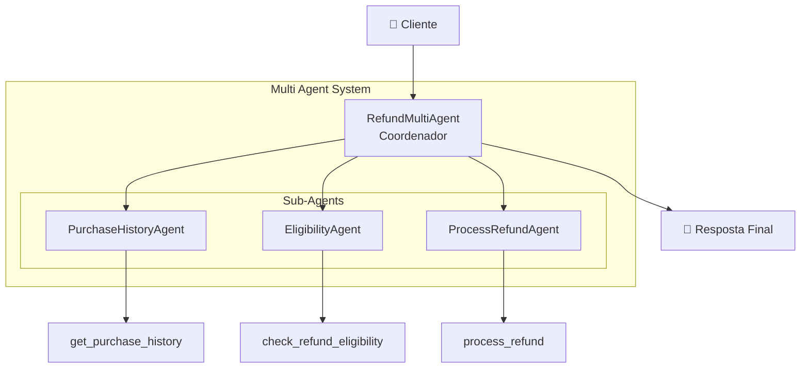
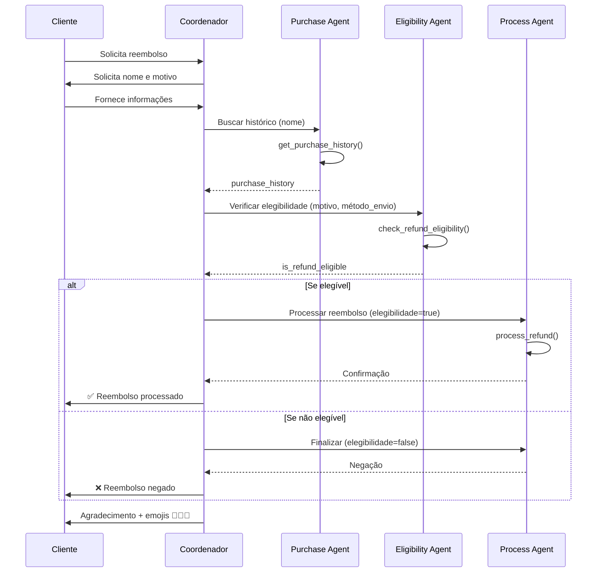

# Multi LLM Agent - Sistema de Reembolso Natura

## 📋 Visão Geral

O padrão Multi LLM Agent implementa o **Coordinator/Dispatcher pattern**, onde um agente principal coordena múltiplos sub-agentes especializados, cada um responsável por uma etapa específica do processo.

## 🏗️ Arquitetura



## 🔧 Implementação

### Agente Coordenador

```python
root_agent = Agent(
    model=GEMINI_MODEL,
    name="RefundMultiAgent",
    description="Customer refund multi LLM agent for Natura company",
    instruction="""
    You are a multi agent system that coordinates sub-agents. Execute the following instructions in as few "turns" as you can, only prompting the user when needed. Coordinate the sub agents behind the scenes...
    """ + top_level_prompt,
    sub_agents=[purchase_history_agent, eligibility_agent, process_refund_agent],
)
```

### Sub-Agentes Especializados

#### 1. Purchase History Agent
```python
purchase_history_agent = Agent(
    model=GEMINI_MODEL,
    name="PurchaseHistoryAgent",
    description="Retrieves and verifies purchase history",
    instruction=purchase_history_subagent_prompt,
    tools=[get_purchase_history],
    output_key="purchase_history",
)
```

#### 2. Eligibility Agent
```python
eligibility_agent = Agent(
    model=GEMINI_MODEL,
    name="EligibilityAgent", 
    description="Checks refund eligibility based on policies",
    instruction=check_eligibility_subagent_prompt,
    tools=[check_refund_eligibility],
    output_key="is_refund_eligible",
)
```

#### 3. Process Refund Agent
```python
process_refund_agent = Agent(
    model=GEMINI_MODEL,
    name="ProcessRefundAgent",
    description="Processes approved refunds",
    instruction=process_refund_subagent_prompt,
    tools=[process_refund],
)
```

## 📝 Responsabilidades dos Agentes

### Coordenador (RefundMultiAgent)
- **Função**: Orquestração geral do fluxo
- **Responsabilidades**:
  - Coleta de informações do cliente
  - Coordenação entre sub-agentes
  - Decisão final sobre o processo
  - Comunicação com o cliente

### Purchase History Agent
- **Função**: Verificação de compras
- **Responsabilidades**:
  - Buscar histórico do cliente
  - Validar dados do pedido
  - Extrair informações de envio
  - Formatar dados para próxima etapa

### Eligibility Agent
- **Função**: Análise de elegibilidade
- **Responsabilidades**:
  - Converter motivo para código
  - Verificar método de envio
  - Aplicar regras de negócio
  - Retornar decisão (true/false)

### Process Refund Agent
- **Função**: Processamento final
- **Responsabilidades**:
  - Verificar status de elegibilidade
  - Executar reembolso se aprovado
  - Gerar mensagem de resposta
  - Finalizar processo

## ✅ Vantagens

- **Separação de responsabilidades**: Cada agente tem função específica
- **Reutilização**: Sub-agentes podem ser usados em outros fluxos
- **Manutenção**: Mudanças isoladas por domínio
- **Escalabilidade**: Fácil adicionar novos sub-agentes
- **Especialização**: Prompts otimizados por função

## ❌ Desvantagens

- **Complexidade**: Mais componentes para gerenciar
- **Latência**: Overhead de coordenação
- **Debug**: Logs distribuídos entre agentes
- **Configuração**: Mais arquivos e configurações

## 🎯 Casos de Uso Ideais

- **Sistemas modulares**: Quando diferentes equipes mantêm diferentes partes
- **Fluxos complexos**: Múltiplas etapas com lógicas distintas
- **Reutilização**: Sub-agentes usados em outros contextos
- **Especialização**: Diferentes modelos/configurações por função

## 📊 Fluxo de Execução



## 🔗 Comunicação entre Agentes

### Dados Compartilhados

Os agentes comunicam através de **output_keys**:

```python
# Purchase History Agent produz:
"purchase_history": [
    {
        "order_id": "NAT002-20250610",
        "shipping_method": "INSURED",
        "total_amount": 74.80,
        # ... outros dados
    }
]

# Eligibility Agent produz:
"is_refund_eligible": "true"  # ou "false"

# Process Refund Agent consome ambos
```

### Estado da Sessão

Os dados fluem através do estado da sessão, permitindo que cada agente acesse informações dos anteriores.

## 🧪 Exemplo de Execução

### Caso Bem-Sucedido (Massini)

```python
# 1. Coordenador coleta informações
user_input = "Preciso de reembolso"
coordenador_response = "Qual seu primeiro nome?"
user_response = "Massini"
coordenador_response = "Qual o motivo do reembolso?"
user_response = "Produto chegou danificado"

# 2. Purchase History Agent
purchase_agent_result = {
    "purchase_history": [{
        "order_id": "NAT002-20250610",
        "shipping_method": "INSURED",
        "total_amount": 74.80
    }]
}

# 3. Eligibility Agent
eligibility_agent_result = {
    "is_refund_eligible": "true"
}

# 4. Process Refund Agent
process_agent_result = """
✅ Reembolso REF-NAT002-20250610-7480 realizado com sucesso! 
Creditaremos R$74.80 em sua conta em até 2 dias úteis.
"""

# 5. Coordenador finaliza
final_response = process_agent_result + "\nObrigado por ser cliente da Natura! 💄✨🌿"
```

## 📈 Métricas de Performance

- **Tempo médio de resposta**: ~5-8 segundos
- **Complexidade de implementação**: Média
- **Facilidade de manutenção**: Alta (modular)
- **Extensibilidade**: Alta
- **Reutilização de componentes**: Alta

## 🔄 Comparação com Outros Padrões

| Aspecto | Single Agent | Multi Agent | Sequential | Parallel |
|---------|-------------|-------------|------------|----------|
| Complexidade | Baixa | Média | Média | Alta |
| Flexibilidade | Baixa | Alta | Média | Alta |
| Performance | Boa | Média | Boa | Melhor |
| Manutenção | Simples | Modular | Estruturada | Complexa |

## 🚀 Próximos Passos

Para otimizar ainda mais o sistema Multi-Agent:

1. **Adicionar cache**: Para respostas do Purchase History Agent
2. **Implement retry logic**: Para casos de falha de sub-agentes
3. **Monitoring**: Métricas específicas por sub-agente
4. **A/B Testing**: Diferentes prompts por agente
