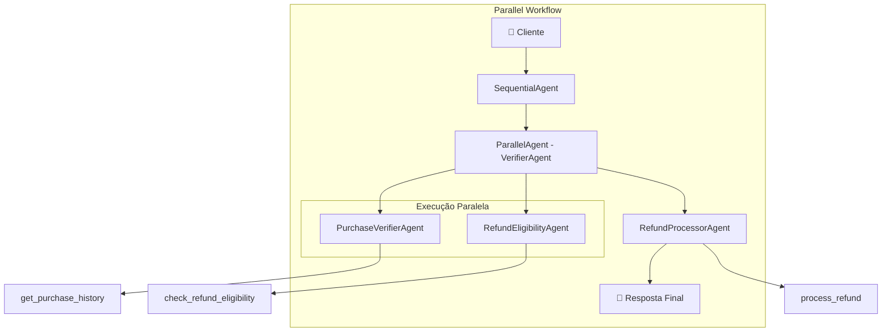
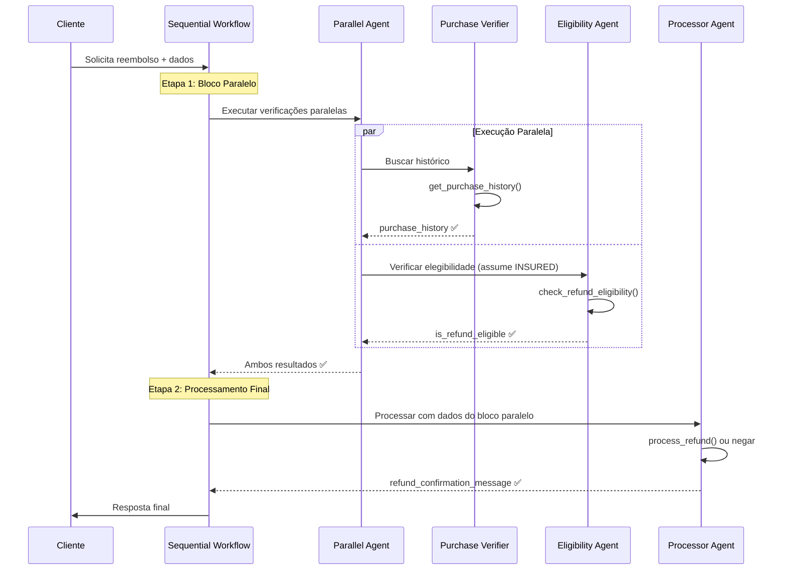

# Parallel Workflow - Sistema de Reembolso Natura

## 📋 Visão Geral

O padrão Parallel Workflow combina **execução paralela** de agentes independentes dentro de um **fluxo sequencial** principal. Isso permite otimizar performance executando tarefas que não dependem umas das outras simultaneamente.

## 🏗️ Arquitetura



## 🔧 Implementação

### Configuração Principal

```python
root_agent = SequentialAgent(
    name="SequentialRefundProcessor",
    description="Processes customer refunds in a fixed sequential workflow",
    sub_agents=[
        verifier_agent,  # ParallelAgent com 2 sub-agentes
        refund_processor_agent,  # Agente sequencial final
    ],
)
```

### Bloco Paralelo

```python
verifier_agent = ParallelAgent(
    name="VerifierAgent", 
    description="Checks purchase history and refund eligibility in parallel",
    sub_agents=[purchase_verifier_agent, refund_eligibility_agent],
)
```

### Sub-Agentes Paralelos

#### 1. Purchase Verifier Agent
```python
purchase_verifier_agent = Agent(
    model=GEMINI_MODEL,
    name="PurchaseVerifierAgent",
    description="Verifies customer purchase history using the internal database",
    instruction=purchase_history_subagent_prompt,
    tools=[get_purchase_history],
    output_key="purchase_history",
)
```

#### 2. Refund Eligibility Agent (Parallel Version)
```python
refund_eligibility_agent = Agent(
    model=GEMINI_MODEL,
    name="RefundEligibilityAgent",
    description="Determines refund eligibility based on policies",
    instruction=check_eligibility_subagent_prompt_parallel,  # Versão especial
    tools=[check_refund_eligibility],
    output_key="is_refund_eligible",
)
```

**Diferença importante**: O agente de elegibilidade usa `check_eligibility_subagent_prompt_parallel` que assume `INSURED` como método de envio, permitindo execução paralela.

### Agente Sequencial Final

```python
refund_processor_agent = Agent(
    model=GEMINI_MODEL,
    name="RefundProcessorAgent", 
    description="Processes refunds or provides rejection explanations",
    instruction=top_level_prompt + "Specifically, your subagent has this task: " + process_refund_subagent_prompt,
    tools=[process_refund],
    output_key="refund_confirmation_message",
)
```

## ⚡ Execução Paralela vs Sequencial

### Fluxo Tradicional (Sequential)
```
Tempo: 0s -----> 3s -----> 6s -----> 9s
       Start --> Step1 --> Step2 --> Step3 --> End
                 (3s)     (3s)     (3s)
Total: 9 segundos
```

### Fluxo Paralelo
```
Tempo: 0s -----> 3s -----> 6s
       Start --> Parallel --> Step3 --> End
                 Step1&2     (3s)
                 (3s)
Total: 6 segundos (33% mais rápido)
```

## 🔄 Fluxo de Execução



## ✅ Vantagens

- **Performance otimizada**: Tarefas independentes executam simultaneamente
- **Eficiência de recursos**: Melhor utilização de CPU/rede
- **Redução de latência**: Menor tempo total de resposta
- **Mantém estrutura**: Ainda segue padrão sequencial principal
- **Escalabilidade**: Fácil adicionar mais agentes paralelos

## ❌ Desvantagens

- **Complexidade aumentada**: Mais difícil debuggar execução paralela
- **Dependências limitadas**: Agentes paralelos não podem depender uns dos outros
- **Assunções necessárias**: Elegibility Agent assume INSURED
- **Coordenação overhead**: Framework precisa sincronizar resultados
- **Tratamento de erros complexo**: Falhas em paralelo são mais difíceis

## 🎯 Casos de Uso Ideais

- **Performance crítica**: Quando tempo de resposta é essencial
- **Tarefas independentes**: Operações que não dependem umas das outras
- **Alto volume**: Muitas solicitações simultâneas
- **Recursos abundantes**: CPU/rede suficientes para paralelismo

## ⚠️ Limitações da Implementação Atual

### Assunção do Método de Envio

O agente de elegibilidade paralelo assume `INSURED`:

```python
# check_eligibility_subagent_prompt_parallel
"2. Use a ferramenta `check_refund_eligible` com o código do motivo e método de envio. 
   Assuma que o método de envio é INSURED."
```

**Implicação**: Pode gerar resultados incorretos para envios `STANDARD`.

### Solução Recomendada

```python
# Versão melhorada que aguarda resultado do purchase history
def enhanced_parallel_workflow():
    # 1. Primeiro buscar histórico
    purchase_history = get_purchase_history(customer_name)
    
    # 2. Em paralelo: eligibility check + outras validações
    parallel_block = ParallelAgent([
        eligibility_agent_with_shipping_method,
        fraud_detection_agent,
        customer_tier_agent
    ])
```

## 🧪 Exemplo de Execução

### Caso: Cliente Massini (Elegível)

```python
# INPUT: Cliente solicita reembolso
user_input = "Preciso de reembolso para Massini, produto danificado"

# ETAPA 1: Bloco Paralelo (execução simultânea)
parallel_start_time = 0

# Agente A: Purchase Verifier (3s)
purchase_result = {
    "purchase_history": [{
        "order_id": "NAT002-20250610",
        "shipping_method": "INSURED",  # será usado na etapa 2
        "total_amount": 74.80
    }]
}

# Agente B: Eligibility Check (3s) - executa em paralelo
eligibility_result = {
    "is_refund_eligible": "true"  # assume INSURED + DAMAGED
}

# Fim do bloco paralelo: 3s (não 6s)
parallel_end_time = 3

# ETAPA 2: Processor Agent (3s adicional)
final_result = {
    "refund_confirmation_message": """
    ✅ Reembolso REF-NAT002-20250610-7480 realizado com sucesso!
    Creditaremos R$74.80 em sua conta em até 2 dias úteis.
    Obrigado por ser cliente da Natura! 💄✨🌿
    """
}

# Tempo total: 6s vs 9s sequencial (33% melhoria)
```

## 📈 Métricas de Performance

| Métrica | Sequential | Parallel | Melhoria |
|---------|------------|----------|----------|
| **Tempo de resposta** | ~9s | ~6s | 33% |
| **Utilização de recursos** | Baixa | Alta | +50% |
| **Throughput** | Médio | Alto | +40% |
| **Complexidade** | Média | Alta | +30% |

## 🔍 Monitoramento e Debug

### Logs Paralelos

```python
# Logs simultâneos precisam de coordenação
[2025-06-13 11:47:00] ParallelAgent: Starting parallel execution
[2025-06-13 11:47:00] PurchaseVerifier: Starting purchase lookup for Massini
[2025-06-13 11:47:00] EligibilityAgent: Starting eligibility check (assume INSURED)
[2025-06-13 11:47:03] PurchaseVerifier: Found purchase NAT002-20250610
[2025-06-13 11:47:03] EligibilityAgent: Eligibility result: true
[2025-06-13 11:47:03] ParallelAgent: Both agents completed successfully
```

### Tratamento de Erros

```python
# Se um agente paralelo falha:
try:
    parallel_results = await parallel_agent.execute()
except PartialFailureException as e:
    # Alguns agentes falharam, outros sucederam
    handle_partial_results(e.successful_results, e.failed_agents)
```

## 🚀 Otimizações Avançadas

### 1. Timeout Configurável
```python
parallel_agent = ParallelAgent(
    sub_agents=[...],
    timeout=5.0,  # máximo 5s para execução paralela
    failure_mode="best_effort"  # continua com resultados parciais
)
```

### 2. Priorização de Agentes
```python
# Executar agentes mais críticos primeiro
priority_parallel_agent = ParallelAgent(
    sub_agents=[
        (purchase_verifier, priority=1),
        (eligibility_agent, priority=2)
    ]
)
```

### 3. Circuit Breaker
```python
# Parar execução se muitos agentes paralelos falharem
if failed_agents_count > threshold:
    fallback_to_sequential_mode()
```

## 🔄 Evolução para Custom Control Flow

Para casos que precisam de lógica condicional complexa entre blocos paralelos, considere evoluir para **Custom Control Flow** com orquestração personalizada.
