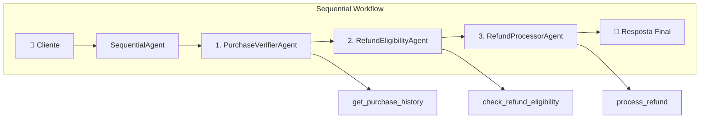
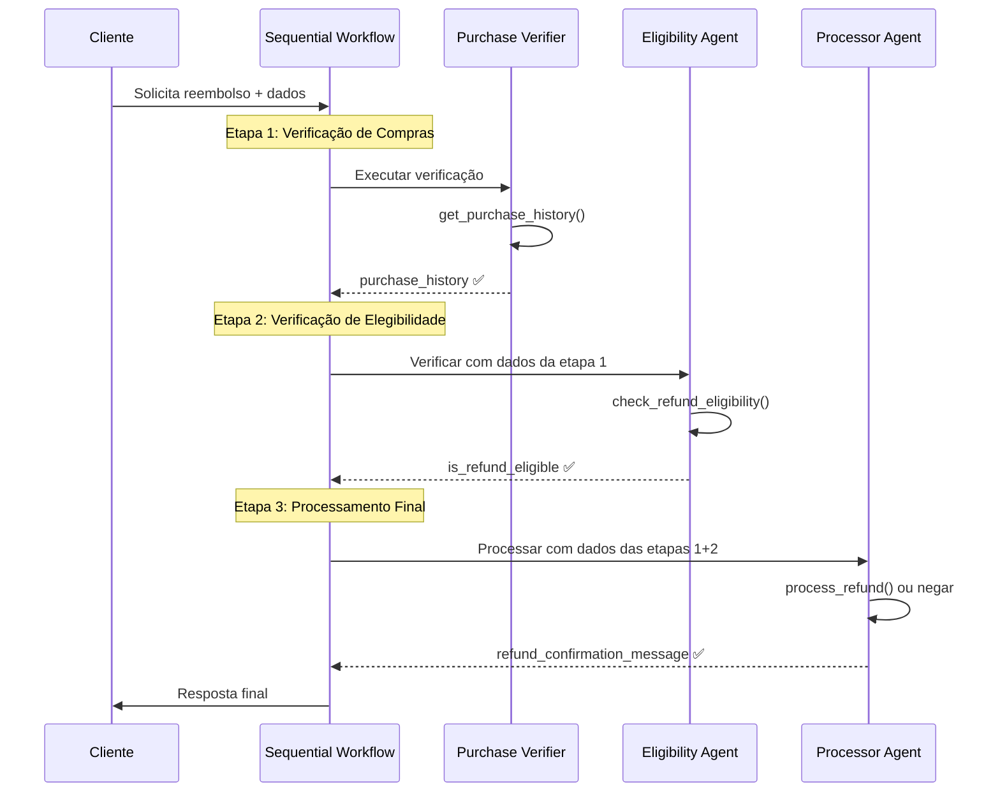

# Sequential Workflow - Sistema de Reembolso Natura

## 📋 Visão Geral

O padrão Sequential Workflow implementa um fluxo estruturado onde os agentes são executados em **sequência fixa e predeterminada**. Cada agente deve completar sua tarefa antes que o próximo seja executado.

## 🏗️ Arquitetura



## 🔧 Implementação

### Configuração Principal

```python
root_agent = SequentialAgent(
    name="SequentialRefundProcessor",
    description="Processes customer refunds in a fixed sequential workflow",
    sub_agents=[
        purchase_verifier_agent,
        refund_eligibility_agent,
        refund_processor_agent,
    ],
)
```

### Agentes da Sequência

#### 1. Purchase Verifier Agent
```python
purchase_verifier_agent = Agent(
    model=GEMINI_MODEL,
    name="PurchaseVerifierAgent",
    description="Verifies customer purchase history using the internal database",
    instruction=purchase_history_subagent_prompt,
    tools=[get_purchase_history],
    output_key="purchase_history",
)
```

#### 2. Refund Eligibility Agent
```python
refund_eligibility_agent = Agent(
    model=GEMINI_MODEL,
    name="RefundEligibilityAgent",
    description="Determines refund eligibility based on policies",
    instruction=check_eligibility_subagent_prompt,
    tools=[check_refund_eligibility],
    output_key="is_refund_eligible",
)
```

#### 3. Refund Processor Agent
```python
refund_processor_agent = Agent(
    model=GEMINI_MODEL,
    name="RefundProcessorAgent",
    description="Processes refunds or provides rejection explanations",
    instruction=top_level_prompt + "Specifically, your subagent has this task: " + process_refund_subagent_prompt,
    tools=[process_refund],
    output_key="refund_confirmation_message",
)
```

## 🔄 Fluxo de Execução Sequencial



## ✅ Vantagens

- **Previsibilidade**: Fluxo sempre segue a mesma ordem
- **Confiabilidade**: Cada etapa depende da anterior
- **Debug facilitado**: Fácil identificar onde falha ocorreu
- **Estrutura clara**: Lógica de negócio bem definida
- **Validação progressiva**: Cada etapa valida a anterior

## ❌ Desvantagens

- **Rigidez**: Não permite pular etapas desnecessárias
- **Performance**: Execução sempre sequencial (sem paralelismo)
- **Flexibilidade limitada**: Difícil adaptar para casos especiais
- **Latência**: Soma das latências de todos os agentes

## 🎯 Casos de Uso Ideais

- **Processos regulamentados**: Onde ordem é obrigatória
- **Validações dependentes**: Cada etapa precisa da anterior
- **Auditoria**: Necessário registro de cada passo
- **Sistemas críticos**: Onde consistência é prioritária

## 📊 Pipeline de Dados

### Estado da Sessão Progressivo

```python
# Após Etapa 1 (Purchase Verifier)
session_state = {
    "purchase_history": [
        {
            "order_id": "NAT002-20250610",
            "shipping_method": "INSURED",
            "total_amount": 74.80,
            "items": [...]
        }
    ]
}

# Após Etapa 2 (Eligibility Agent)
session_state = {
    "purchase_history": [...],  # mantido da etapa anterior
    "is_refund_eligible": "true"
}

# Após Etapa 3 (Processor Agent)
session_state = {
    "purchase_history": [...],
    "is_refund_eligible": "true", 
    "refund_confirmation_message": "✅ Reembolso REF-NAT002-20250610-7480 realizado..."
}
```

## 🧪 Exemplo Completo de Execução

### Caso: Cliente Massini (Elegível)

```python
# INPUT: Cliente solicita reembolso
user_input = "Olá, preciso de um reembolso para Massini, produto chegou danificado"

# ETAPA 1: Purchase Verifier Agent
step1_input = "Massini"
step1_output = {
    "purchase_history": [{
        "order_id": "NAT002-20250610",
        "date": "2025-06-03",
        "shipping_method": "INSURED",
        "total_amount": 74.80,
        "items": [
            {"product_name": "Desodorante Natura Humor", "price": 45.90},
            {"product_name": "Shampoo Plant Cachos", "price": 28.90}
        ]
    }]
}

# ETAPA 2: Eligibility Agent
step2_input = {
    "reason": "produto chegou danificado",  # convertido para DAMAGED
    "shipping_method": "INSURED",  # extraído da etapa 1
}
step2_output = {
    "is_refund_eligible": "true"  # INSURED + DAMAGED = elegível
}

# ETAPA 3: Processor Agent
step3_input = {
    "is_refund_eligible": "true",
    "amount": 74.80,
    "order_id": "NAT002-20250610"
}
step3_output = {
    "refund_confirmation_message": """
    ✅ Reembolso REF-NAT002-20250610-7480 realizado com sucesso! 
    Creditaremos R$74.80 em sua conta em até 2 dias úteis.
    Obrigado por ser cliente da Natura! 💄✨🌿
    """
}

# OUTPUT FINAL
final_response = step3_output["refund_confirmation_message"]
```

## ⚠️ Tratamento de Falhas

### Falha na Etapa 1 (Sem Histórico)
```python
step1_output = {"purchase_history": []}
# Workflow continua, mas será negado na etapa 3
```

### Falha na Etapa 2 (Não Elegível)
```python
step2_output = {"is_refund_eligible": "false"}
# Workflow continua para etapa 3 que processa a negação
```

### Falha na Etapa 3 (Erro de Processamento)
```python
# Sistema tenta processar mas falha
# Agente retorna mensagem de erro padrão
```

## 📈 Métricas de Performance

- **Tempo médio de resposta**: ~6-10 segundos
- **Complexidade de implementação**: Média
- **Facilidade de manutenção**: Alta (estruturada)
- **Extensibilidade**: Média (requer modificar sequência)
- **Confiabilidade**: Muito Alta

## 🔄 Comparação com Multi-Agent

| Aspecto | Sequential Workflow | Multi-Agent |
|---------|-------------------|-------------|
| **Execução** | Sequencial obrigatória | Coordenada flexível |
| **Controle** | Framework controla | Agente coordenador |
| **Flexibilidade** | Baixa | Alta |
| **Previsibilidade** | Muito Alta | Média |
| **Performance** | Média | Variável |

## 🚀 Otimizações Possíveis

### 1. Early Exit
```python
# Adicionar lógica para parar execução se não há histórico
if not purchase_history:
    return "Nenhum histórico encontrado"
```

### 2. Conditional Steps
```python
# Pular etapas baseado em condições
if shipping_method != "INSURED":
    # Pular verificação detalhada
    return "Não elegível - envio não segurado"
```

### 3. Caching
```python
# Cache resultados de purchase_history para evitar re-consultas
cache_key = f"purchase_{customer_name}"
```

## 🔄 Evolução para Parallel Workflow

Quando performance se torna crítica, considere evoluir para **Parallel Workflow** onde etapas independentes podem executar simultaneamente.
