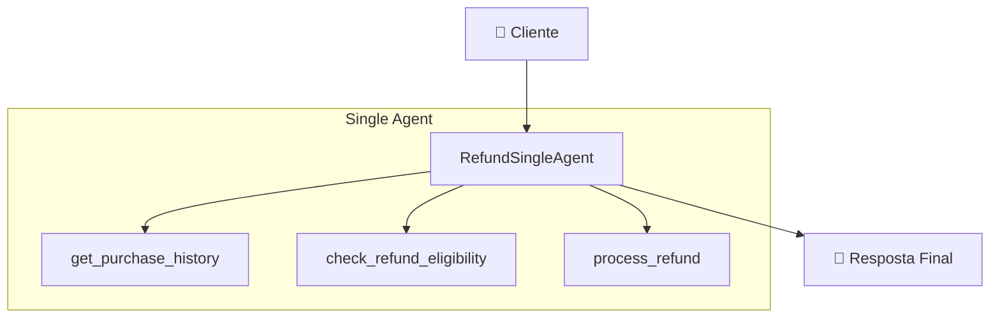
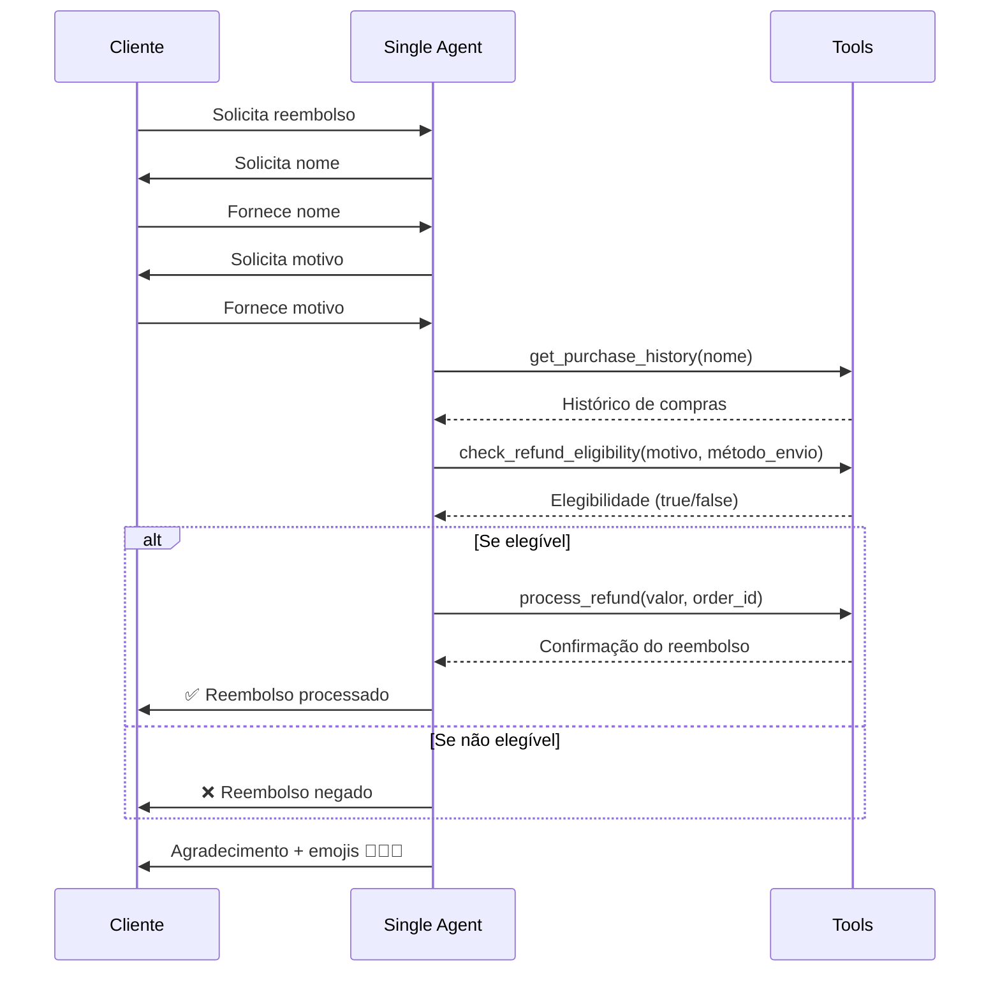

# Single Agent - Sistema de Reembolso Natura

## 📋 Visão Geral

O padrão Single Agent implementa todo o fluxo de reembolso em um único agente que gerencia todas as etapas do processo de forma sequencial e coordenada.

## 🏗️ Arquitetura



## 🔧 Implementação

### Configuração do Agente

```python
root_agent = Agent(
    model=GEMINI_MODEL,
    name="RefundSingleAgent",
    description="Customer refund single-agent for Natura company",
    instruction=top_level_prompt,
    tools=[get_purchase_history, check_refund_eligibility, process_refund],
)
```

### Ferramentas Disponíveis

1. **`get_purchase_history`** - Busca histórico de compras
2. **`check_refund_eligibility`** - Verifica elegibilidade
3. **`process_refund`** - Processa o reembolso

## 📝 Prompt Principal

O agente utiliza o `top_level_prompt` que define:

1. **Personalidade**: Agente amigável da Natura
2. **Coleta de informações**: Nome e motivo
3. **Processo sequencial**:
   - Obter histórico de compras
   - Verificar elegibilidade
   - Processar reembolso ou negar
4. **Finalização**: Agradecimento com emojis

## ✅ Vantagens

- **Simplicidade**: Implementação direta e fácil de entender
- **Controle centralizado**: Um único ponto de controle
- **Menor latência**: Sem overhead de coordenação entre agentes
- **Debug facilitado**: Logs centralizados em um agente

## ❌ Desvantagens

- **Escalabilidade limitada**: Difícil adicionar complexidade
- **Reutilização baixa**: Lógica acoplada em um só lugar
- **Manutenção**: Mudanças afetam todo o fluxo
- **Paralelização**: Não permite execução paralela de tarefas

## 🎯 Casos de Uso Ideais

- **MVPs e protótipos**: Desenvolvimento rápido
- **Fluxos simples**: Processos lineares sem ramificações complexas
- **Sistemas pequenos**: Poucos tipos de solicitações
- **Demonstrações**: Provas de conceito

## 📊 Fluxo de Execução



## 🧪 Exemplo de Execução

### Caso Bem-Sucedido (Massini)

```python
# Input do usuário
user_input = "Quero um reembolso"

# Processo interno do agente:
# 1. Coleta nome: "Massini"
# 2. Coleta motivo: "Produto chegou danificado"
# 3. Busca histórico: encontra pedido NAT002-20250610
# 4. Verifica elegibilidade: INSURED + DAMAGED = ✅
# 5. Processa reembolso: REF-NAT002-20250610-7480
# 6. Resposta final com agradecimento

final_response = """
✅ Reembolso REF-NAT002-20250610-7480 realizado com sucesso! 
Creditaremos R$74.80 em sua conta em até 2 dias úteis.
Obrigado por ser cliente da Natura! 💄✨🌿
"""
```

### Caso Negado (Erike)

```python
# Input do usuário
user_input = "Preciso de reembolso"

# Processo interno:
# 1. Coleta nome: "Erike"
# 2. Coleta motivo: "Produto chegou danificado"
# 3. Busca histórico: encontra pedido NAT001-20250415
# 4. Verifica elegibilidade: STANDARD + DAMAGED = ❌
# 5. Negação educada

final_response = """
Lamento, mas não é possível atender à sua solicitação de reembolso.
Obrigado por ser cliente da Natura! 💄✨🌿
"""
```

## 📈 Métricas de Performance

- **Tempo médio de resposta**: ~3-5 segundos
- **Complexidade de implementação**: Baixa
- **Facilidade de manutenção**: Alta (para casos simples)
- **Extensibilidade**: Baixa

## 🔄 Evolução para Outros Padrões

Quando o Single Agent se torna limitado, considere:

1. **Multi-Agent**: Para separar responsabilidades
2. **Sequential Workflow**: Para fluxos mais estruturados
3. **Parallel Workflow**: Para otimizar performance
4. **Custom Control Flow**: Para lógica complexa de decisão
