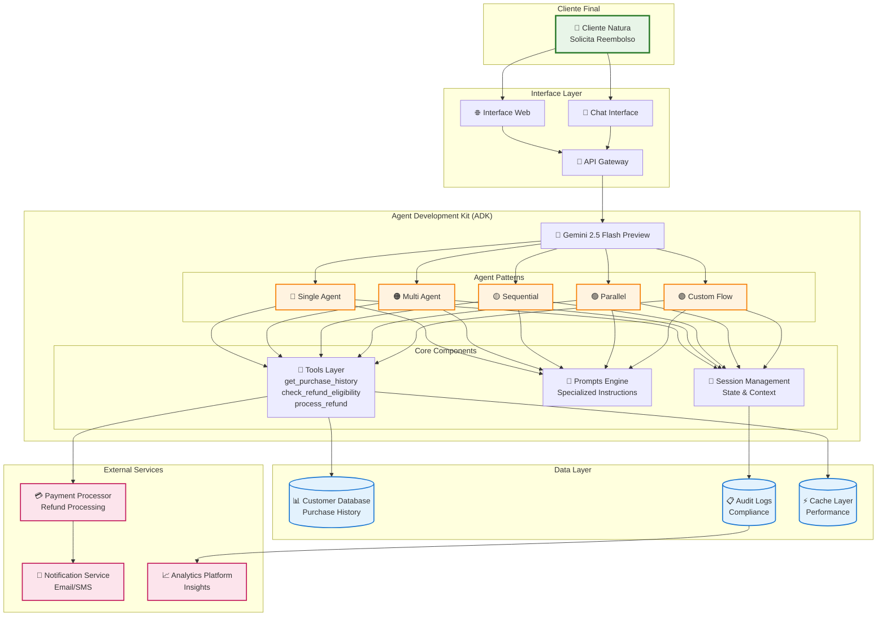
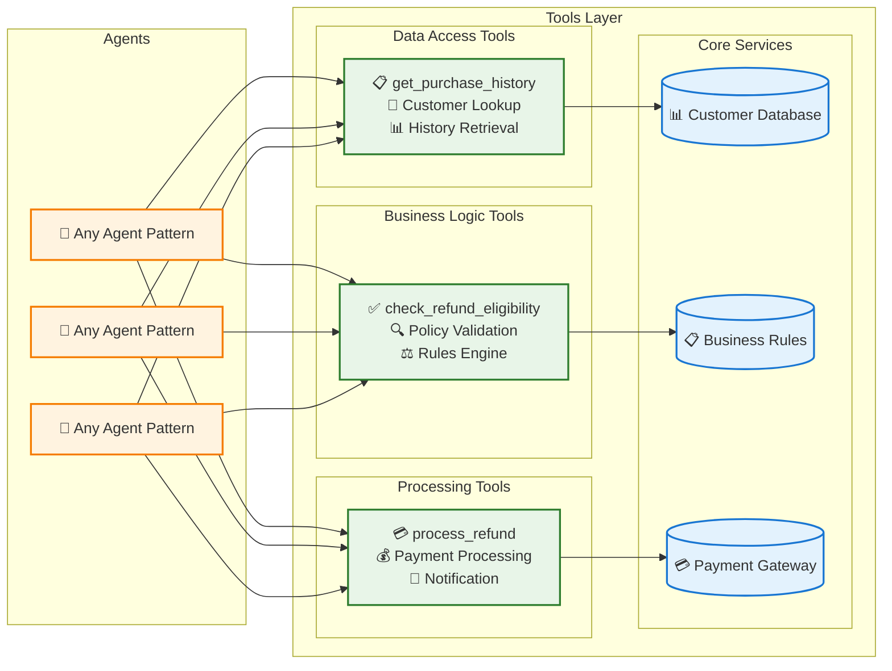
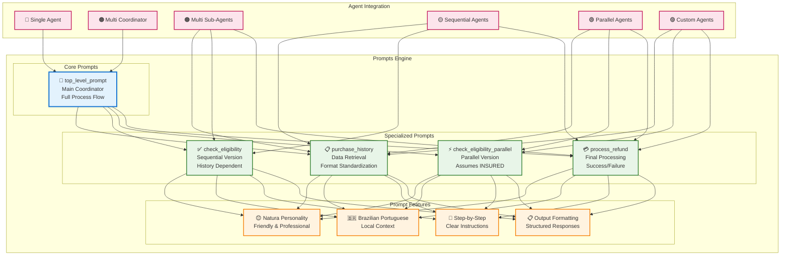
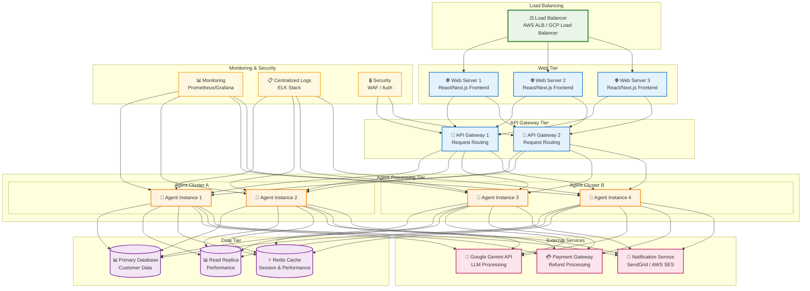
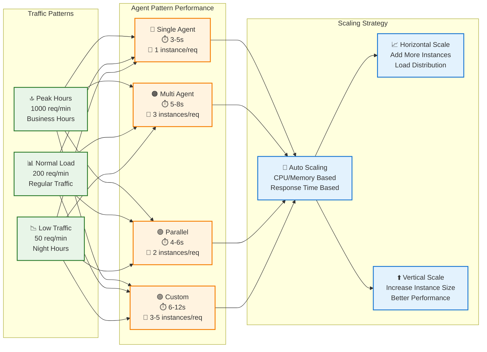

# Architecture Diagrams - Sistema de Reembolso Natura

## 📋 Visão Geral

Esta seção apresenta os diagramas de arquitetura do sistema de reembolso Natura, mostrando desde a visão high-level até os detalhes de implementação dos diferentes padrões de agentes.

## 🏗️ Arquitetura Geral do Sistema

### Sistema Completo - Visão High-Level



## 🔄 Comparação de Padrões Arquiteturais

### Os 5 Padrões Lado a Lado

```mermaid
graph TB
    subgraph "1. Single Agent"
        SA_INPUT[📥 Input] --> SA_AGENT[🔵 RefundSingleAgent]
        SA_AGENT --> SA_TOOLS[🔧 All Tools]
        SA_TOOLS --> SA_OUTPUT[📤 Output]
        
        SA_METRICS[⏱️ 3-5s<br/>🔧 Simple<br/>📊 Low Scale]
    end
    
    subgraph "2. Multi Agent"
        MA_INPUT[📥 Input] --> MA_COORD[🟠 Coordinator]
        MA_COORD --> MA_SUB1[📋 Purchase Agent]
        MA_COORD --> MA_SUB2[✅ Eligibility Agent]
        MA_COORD --> MA_SUB3[💳 Process Agent]
        MA_SUB1 & MA_SUB2 & MA_SUB3 --> MA_OUTPUT[📤 Output]
        
        MA_METRICS[⏱️ 5-8s<br/>🔧 Modular<br/>📊 Med Scale]
    end
    
    subgraph "3. Sequential Workflow"
        SEQ_INPUT[📥 Input] --> SEQ_STEP1[1️⃣ Purchase Verifier]
        SEQ_STEP1 --> SEQ_STEP2[2️⃣ Eligibility Check]
        SEQ_STEP2 --> SEQ_STEP3[3️⃣ Refund Processor]
        SEQ_STEP3 --> SEQ_OUTPUT[📤 Output]
        
        SEQ_METRICS[⏱️ 6-10s<br/>🔧 Structured<br/>📊 Reliable]
    end
    
    subgraph "4. Parallel Workflow"
        PAR_INPUT[📥 Input] --> PAR_PARALLEL[🟢 Parallel Block]
        PAR_PARALLEL --> PAR_P1[📋 Purchase] & PAR_P2[✅ Eligibility]
        PAR_P1 & PAR_P2 --> PAR_SEQ[💳 Sequential Process]
        PAR_SEQ --> PAR_OUTPUT[📤 Output]
        
        PAR_METRICS[⏱️ 4-6s<br/>🔧 Optimized<br/>📊 High Perf]
    end
    
    subgraph "5. Custom Control Flow"
        CUSTOM_INPUT[📥 Input] --> CUSTOM_PARALLEL[🟣 Parallel Checks]
        CUSTOM_PARALLEL --> CUSTOM_DECISION{🤔 Custom Logic}
        CUSTOM_DECISION -->|Eligible| CUSTOM_REFUND[💰 Full Refund]
        CUSTOM_DECISION -->|Not Eligible| CUSTOM_CREDIT[🎫 Store Credit]
        CUSTOM_DECISION -->|No History| CUSTOM_ERROR[❌ Error Message]
        CUSTOM_REFUND & CUSTOM_CREDIT & CUSTOM_ERROR --> CUSTOM_OUTPUT[📤 Output]
        
        CUSTOM_METRICS[⏱️ 6-12s<br/>🔧 Complex<br/>📊 Flexible]
    end
    
    %% Styling for clarity
    classDef singleStyle fill:#e3f2fd,stroke:#1976d2
    classDef multiStyle fill:#fff3e0,stroke:#f57c00
    classDef seqStyle fill:#f3e5f5,stroke:#7b1fa2
    classDef parStyle fill:#e8f5e8,stroke:#388e3c
    classDef customStyle fill:#fce4ec,stroke:#c2185b
    
    class SA_INPUT,SA_AGENT,SA_TOOLS,SA_OUTPUT,SA_METRICS singleStyle
    class MA_INPUT,MA_COORD,MA_SUB1,MA_SUB2,MA_SUB3,MA_OUTPUT,MA_METRICS multiStyle
    class SEQ_INPUT,SEQ_STEP1,SEQ_STEP2,SEQ_STEP3,SEQ_OUTPUT,SEQ_METRICS seqStyle
    class PAR_INPUT,PAR_PARALLEL,PAR_P1,PAR_P2,PAR_SEQ,PAR_OUTPUT,PAR_METRICS parStyle
    class CUSTOM_INPUT,CUSTOM_PARALLEL,CUSTOM_DECISION,CUSTOM_REFUND,CUSTOM_CREDIT,CUSTOM_ERROR,CUSTOM_OUTPUT,CUSTOM_METRICS customStyle
```



## 🧩 Componentes Detalhados

### Tools Layer Architecture



### Prompts Engine Architecture



## 🔄 Data Flow Architecture

### Complete Data Flow Through System

```mermaid
graph TD
    subgraph "Input Processing"
        USER_INPUT[👤 User Input<br/>"Massini - produto danificado"]
        PARSE[🔍 Input Parsing<br/>Name Extraction<br/>Reason Extraction]
    end
    
    subgraph "Agent Processing"
        AGENT[🤖 Selected Agent Pattern<br/>Business Logic Processing]
        
        subgraph "Tool Calls"
            T1[📋 get_purchase_history("Massini")]
            T2[✅ check_refund_eligibility("DAMAGED", "INSURED")]
            T3[💳 process_refund(74.80, "NAT002-20250610")]
        end
        
        subgraph "Data Transformation"
            CONVERT[🔄 Reason Mapping<br/>"danificado" → DAMAGED]
            EXTRACT[📤 Data Extraction<br/>shipping_method: INSURED]
            VALIDATE[✔️ Policy Validation<br/>INSURED + DAMAGED = ✅]
        end
    end
    
    subgraph "Data Storage"
        SESSION[📝 Session State<br/>purchase_history: [...]<br/>is_refund_eligible: true]
        LOGS[📋 Audit Logs<br/>Compliance Recording]
        CACHE[⚡ Cache Updates<br/>Performance Optimization]
    end
    
    subgraph "Output Generation"
        RESPONSE[📤 Formatted Response<br/>Natura Branding<br/>Emojis + Thanks]
        NOTIFY[📧 Notifications<br/>Email Confirmation<br/>SMS Updates]
    end
    
    USER_INPUT --> PARSE
    PARSE --> AGENT
    AGENT --> T1 --> EXTRACT
    AGENT --> CONVERT --> T2 --> VALIDATE
    VALIDATE --> T3
    
    T1 & T2 & T3 --> SESSION
    SESSION --> LOGS & CACHE
    SESSION --> RESPONSE
    RESPONSE --> NOTIFY
    
    classDef inputStyle fill:#e8f5e8,stroke:#2e7d2e,stroke-width:2px
    classDef processStyle fill:#fff3e0,stroke:#f57c00,stroke-width:2px
    classDef storageStyle fill:#e3f2fd,stroke:#1976d2,stroke-width:2px
    classDef outputStyle fill:#fce4ec,stroke:#c2185b,stroke-width:2px
    
    class USER_INPUT,PARSE inputStyle
    class AGENT,T1,T2,T3,CONVERT,EXTRACT,VALIDATE processStyle
    class SESSION,LOGS,CACHE storageStyle
    class RESPONSE,NOTIFY outputStyle
```

## 🚀 Deployment Architecture

### Production Deployment Scenario



## 📊 Performance & Scalability

### System Capacity Planning



## 🔐 Security Architecture

### Security Layers

```mermaid
graph TB
    subgraph "Security Perimeter"
        WAF[🛡️ Web Application Firewall<br/>DDoS Protection<br/>Bot Detection]
        CDN[🌐 Content Delivery Network<br/>Edge Security<br/>SSL Termination]
    end
    
    subgraph "Application Security"
        AUTH[🔐 Authentication<br/>OAuth 2.0 / JWT<br/>Multi-Factor Auth]
        AUTHZ[✅ Authorization<br/>Role-Based Access<br/>Permission Management]
        ENCRYPT[🔒 Encryption<br/>Data at Rest<br/>Data in Transit]
    end
    
    subgraph "Data Protection"
        PII[👤 PII Protection<br/>Customer Data<br/>LGPD Compliance]
        AUDIT[📋 Audit Logging<br/>Access Tracking<br/>Compliance Reports]
        BACKUP[💾 Secure Backups<br/>Encrypted Storage<br/>Disaster Recovery]
    end
    
    subgraph "API Security"
        RATE[⏱️ Rate Limiting<br/>Abuse Prevention<br/>Fair Usage]
        VALIDATE[✔️ Input Validation<br/>Injection Prevention<br/>Data Sanitization]
        MONITOR[👁️ Security Monitoring<br/>Threat Detection<br/>Incident Response]
    end
    
    WAF --> AUTH
    CDN --> AUTH
    AUTH --> AUTHZ
    AUTHZ --> ENCRYPT
    
    ENCRYPT --> PII
    PII --> AUDIT
    AUDIT --> BACKUP
    
    ENCRYPT --> RATE
    RATE --> VALIDATE
    VALIDATE --> MONITOR
    
    classDef perimeterStyle fill:#ffebee,stroke:#d32f2f,stroke-width:3px
    classDef appStyle fill:#e8f5e8,stroke:#2e7d2e,stroke-width:2px
    classDef dataStyle fill:#e3f2fd,stroke:#1976d2,stroke-width:2px
    classDef apiStyle fill:#fff3e0,stroke:#f57c00,stroke-width:2px
    
    class WAF,CDN perimeterStyle
    class AUTH,AUTHZ,ENCRYPT appStyle
    class PII,AUDIT,BACKUP dataStyle
    class RATE,VALIDATE,MONITOR apiStyle
```



Esta documentação de arquitetura fornece uma visão completa e detalhada do sistema de reembolso Natura, desde os componentes básicos até estratégias de deployment e segurança em produção.
