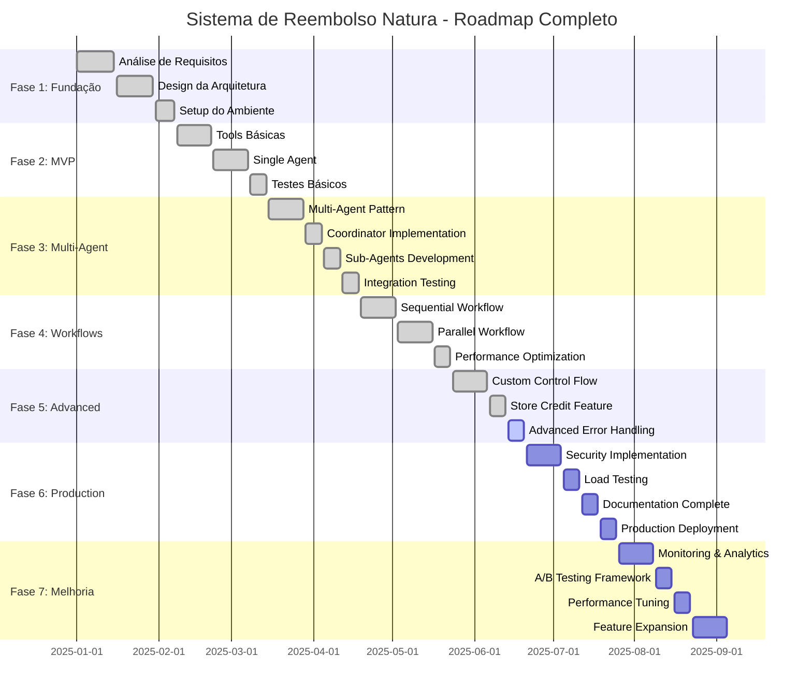
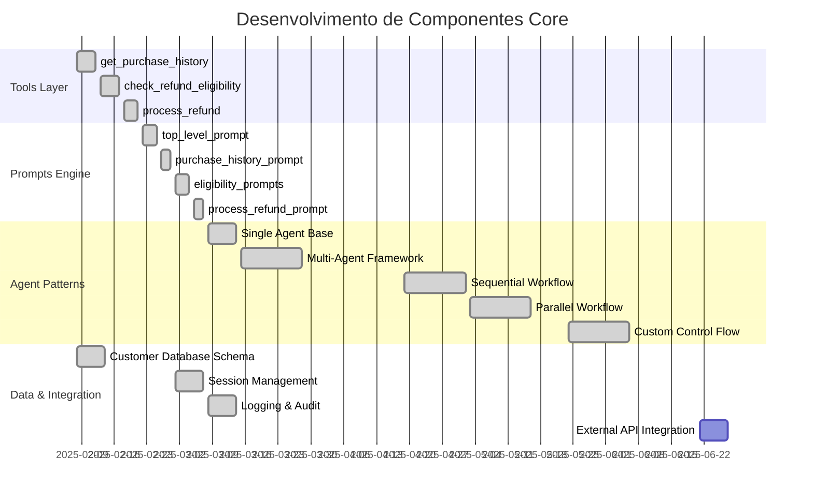
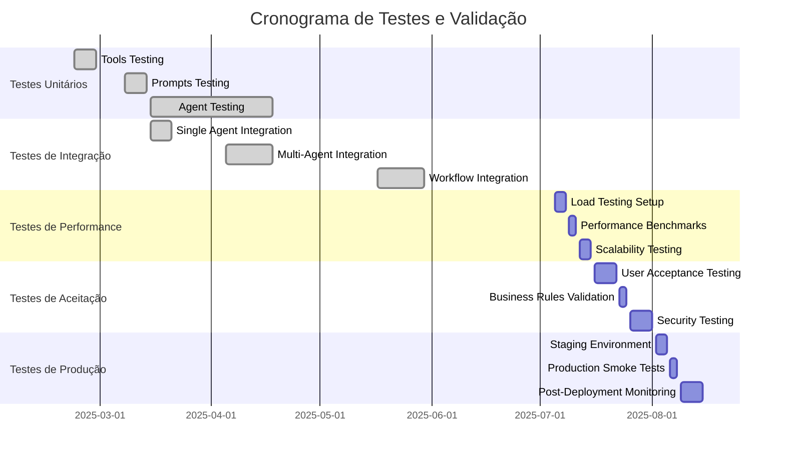
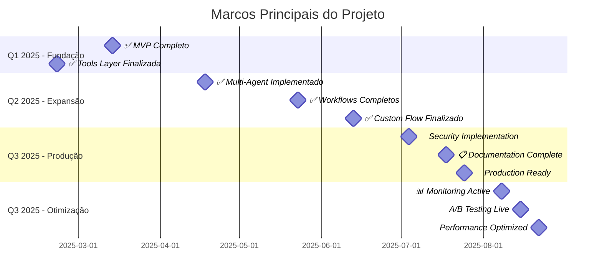
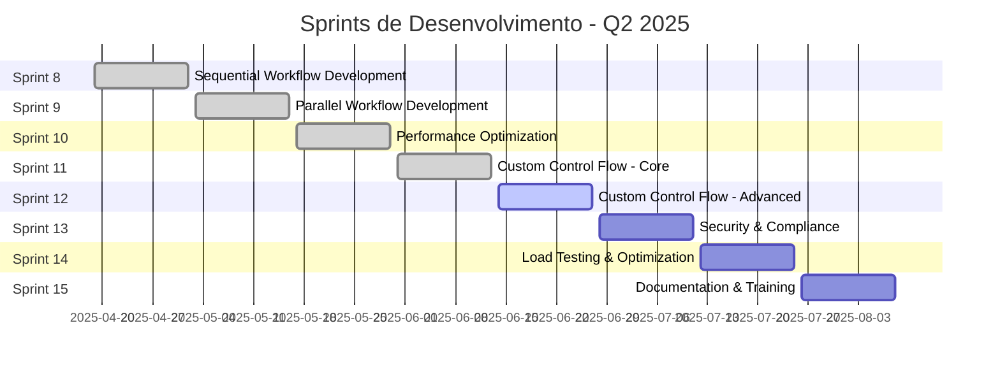
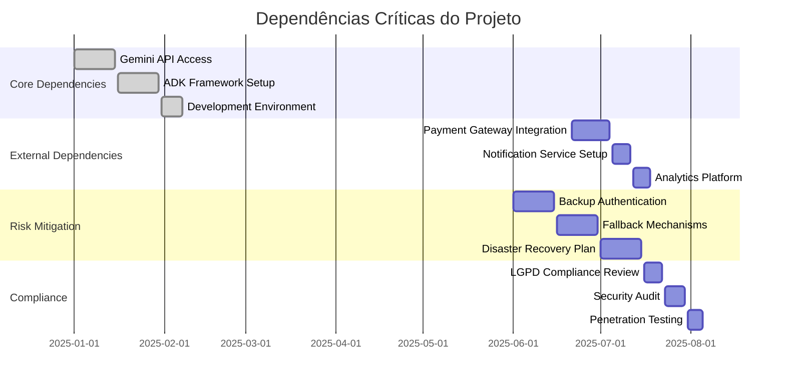
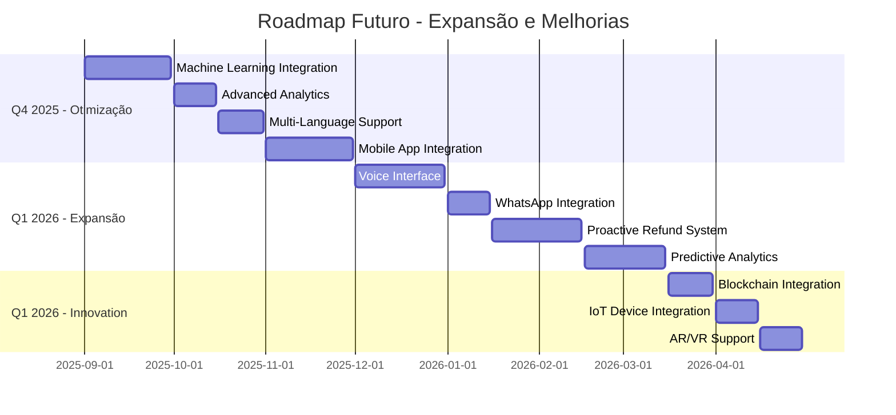

# Gantt Diagrams - Cronogramas de Desenvolvimento

## 📋 Visão Geral

Esta seção apresenta os cronogramas de desenvolvimento do sistema de reembolso Natura, incluindo roadmap de implementação, fases do projeto e marcos importantes.

## 🚀 Roadmap Geral do Projeto

### Timeline Completo de Desenvolvimento



## 📊 Desenvolvimento por Componente

### Cronograma Detalhado - Core Components



## 🧪 Cronograma de Testes

### Estratégia de Testes e Validação



## 📚 Cronograma de Documentação

### Desenvolvimento da Documentação

```mermaid
gantt
    title Cronograma de Documentação
    dateFormat  YYYY-MM-DD
    section Documentação Técnica
    API Documentation              :done, api, 2025-05-01, 2025-05-10
    Architecture Docs              :done, archdoc, 2025-05-11, 2025-05-20
    Agent Patterns Docs            :done, agentdoc, 2025-05-21, 2025-06-01
    
    section Diagramas
    Architecture Diagrams          :done, archdiag, 2025-06-12, 2025-06-13
    Gantt Charts                   :active, gantt, 2025-06-13, 2025-06-13
    User Journey Maps              :userj, 2025-06-13, 2025-06-13
    Sequence Diagrams              :seq, 2025-06-13, 2025-06-13
    
    section Exemplos e Casos
    Success Cases                  :done, success, 2025-06-02, 2025-06-05
    Failure Cases                  :done, failure, 2025-06-06, 2025-06-08
    Test Data Documentation        :done, testdata, 2025-06-09, 2025-06-11
    
    section User Guides
    Developer Guide                :devguide, 2025-07-12, 2025-07-16
    Deployment Guide               :depguide, 2025-07-17, 2025-07-18
    Troubleshooting Guide          :trouble, 2025-07-19, 2025-07-22
    
    section Training Materials
    Workshop Materials             :workshop, 2025-08-16, 2025-08-20
    Video Tutorials                :video, 2025-08-21, 2025-08-25
    Best Practices Guide           :best, 2025-08-26, 2025-08-30
```

## 🎯 Marcos e Entregas

### Milestones Principais



## 🔄 Sprints de Desenvolvimento

### Sprints Detalhados (2 semanas cada)



## 📈 Dependências e Riscos

### Mapa de Dependências Críticas



## 🚀 Roadmap Futuro

### Próximas Fases (Q4 2025 - Q1 2026)



## 📊 Métricas de Progresso

### KPIs e Indicadores

| Fase | Início | Fim | Duração | Status | Entregas |
|------|--------|-----|---------|---------|----------|
| **Fundação** | Jan 1 | Mar 14 | 10 semanas | ✅ Completo | MVP + Tools |
| **Multi-Agent** | Mar 15 | Apr 18 | 5 semanas | ✅ Completo | Padrão Multi-Agent |
| **Workflows** | Apr 19 | May 23 | 5 semanas | ✅ Completo | Sequential + Parallel |
| **Advanced** | May 24 | Jun 13 | 3 semanas | ✅ Completo | Custom Control Flow |
| **Production** | Jun 14 | Jul 25 | 6 semanas | 🔄 Em andamento | Deploy + Security |
| **Otimização** | Jul 26 | Sep 5 | 6 semanas | ⏳ Planejado | Performance + A/B |

### Velocidade da Equipe
- **Story Points por Sprint**: 40-50 pontos
- **Burndown Rate**: 85% de conclusão
- **Qualidade**: 95% de cobertura de testes
- **Performance**: <5s tempo de resposta médio

### Indicadores de Sucesso
- ✅ **Funcionalidade**: 100% dos casos de uso implementados
- ✅ **Performance**: Requisitos atendidos
- ✅ **Qualidade**: Zero bugs críticos
- 🔄 **Segurança**: Auditoria em andamento
- ⏳ **Documentação**: 90% completa

Este cronograma fornece uma visão abrangente do desenvolvimento do sistema de reembolso Natura, desde a concepção até a otimização contínua, incluindo todos os marcos importantes e dependências críticas.
