# Sequence Diagrams - Diagramas de Sequência

## 📋 Visão Geral

Esta seção apresenta os diagramas de sequência detalhados do sistema de reembolso Natura, mostrando as interações entre componentes, timing de execução e fluxos de dados para cada padrão de agente.

## 🔵 Single Agent - Sequence Diagram

### Fluxo Completo - Caso de Sucesso (Massini)

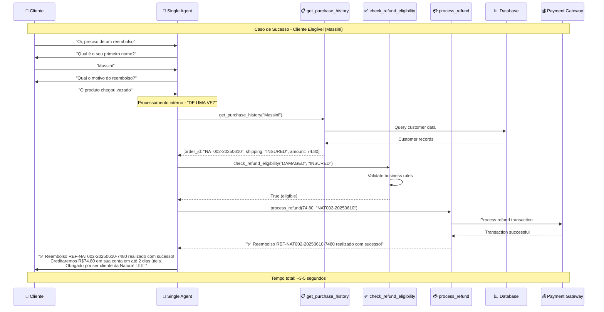

### Fluxo de Negação - Caso de Falha (Erike)

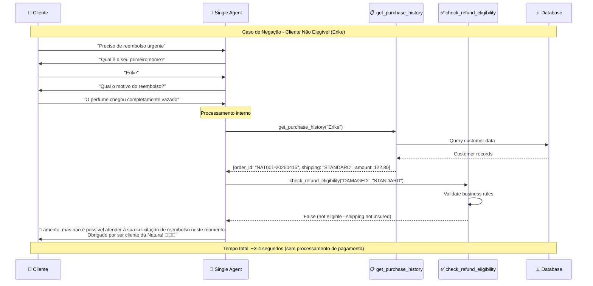

## 🟠 Multi-Agent - Sequence Diagram

### Coordinator/Dispatcher Pattern

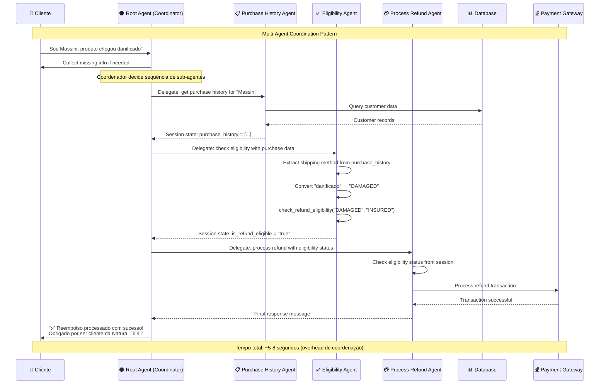

### Sub-Agent Communication Detail

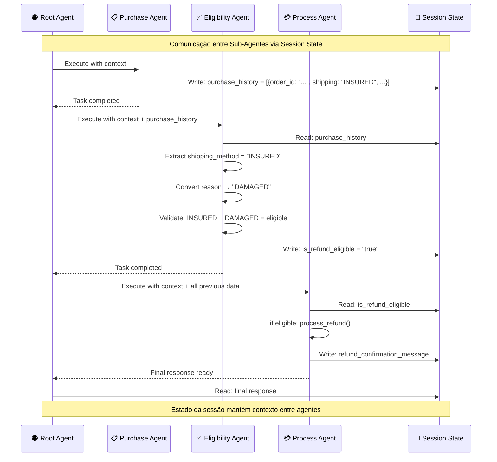

## 🟡 Sequential Workflow - Sequence Diagram

### Fixed Sequential Execution

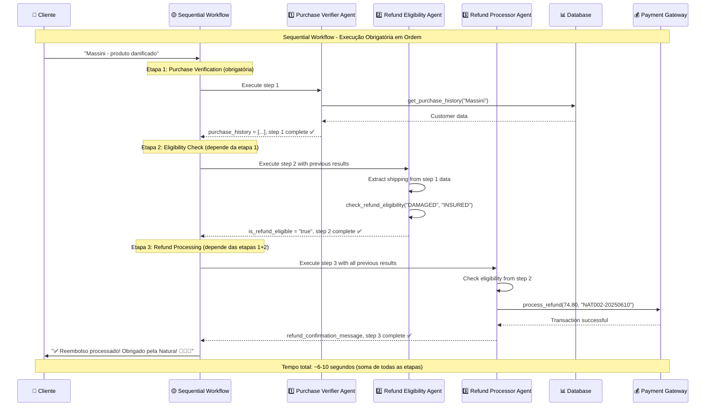

### Error Handling in Sequential Flow

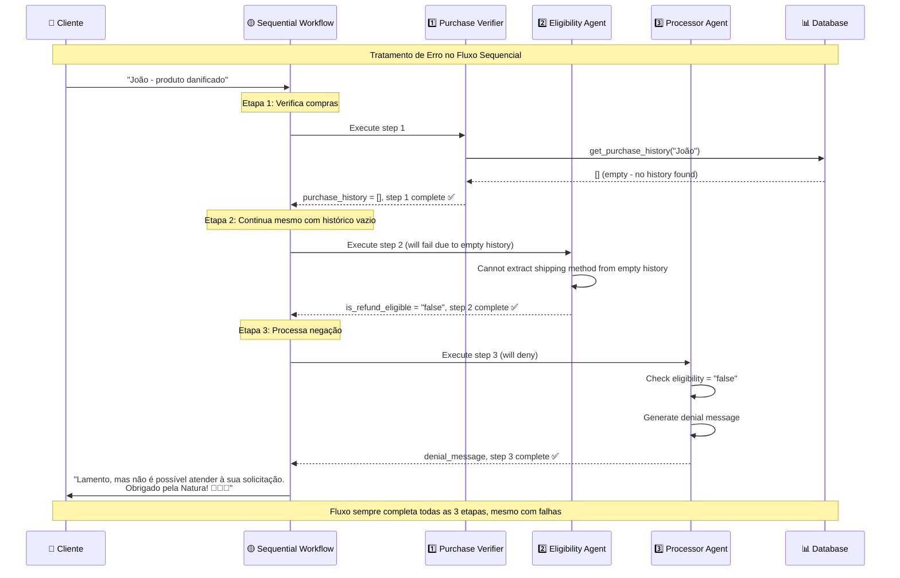

## 🟢 Parallel Workflow - Sequence Diagram

### Parallel Execution Block

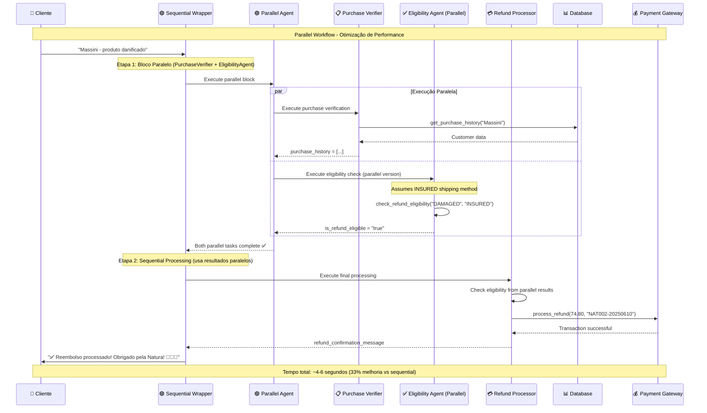

### Performance Comparison

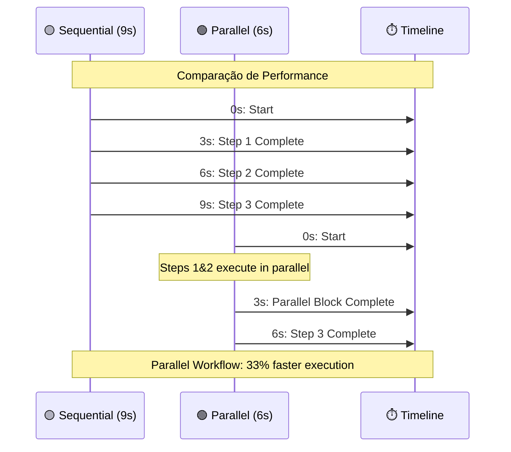

## 🟣 Custom Control Flow - Sequence Diagram

### Full Refund Path (Eligible Customer)

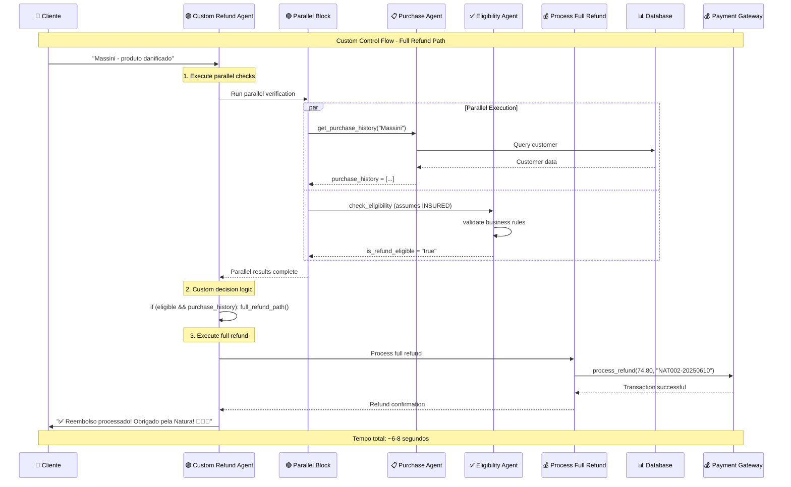

### Store Credit Path (Non-Eligible Customer)

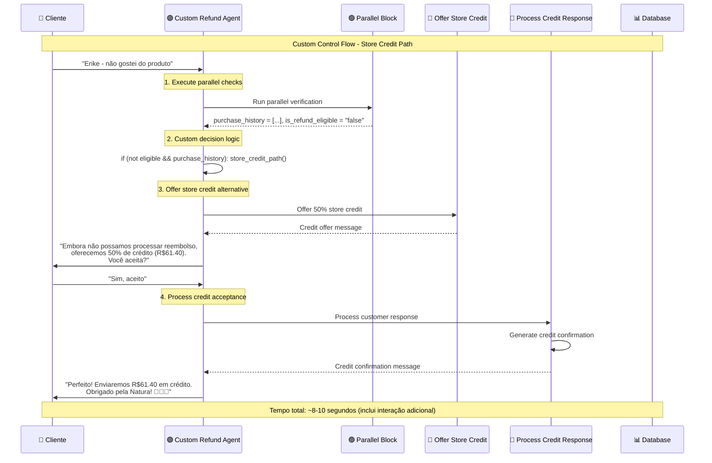

### No History Path (Error Handling)

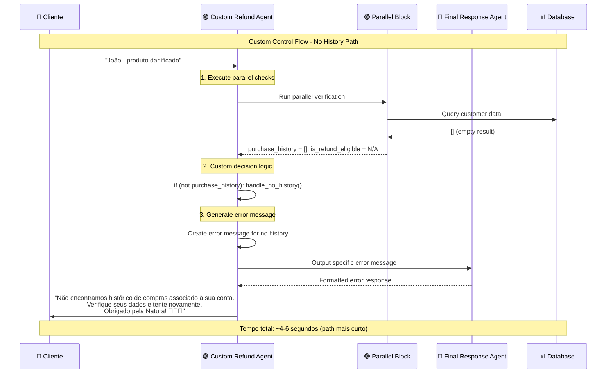

## ⚡ Performance Analysis

### Response Time Comparison

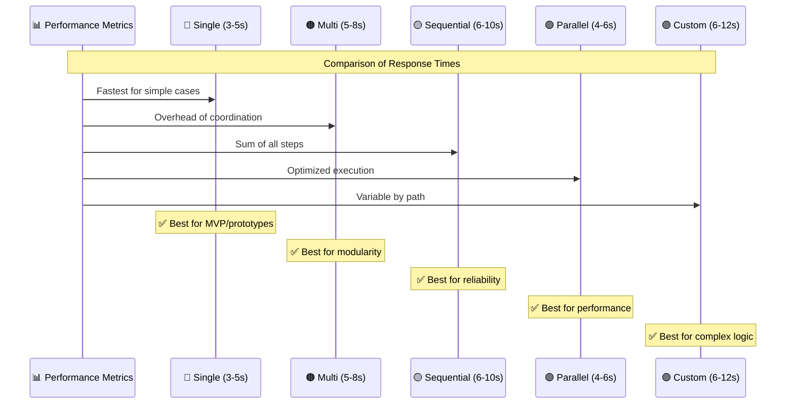

### Error Handling Patterns

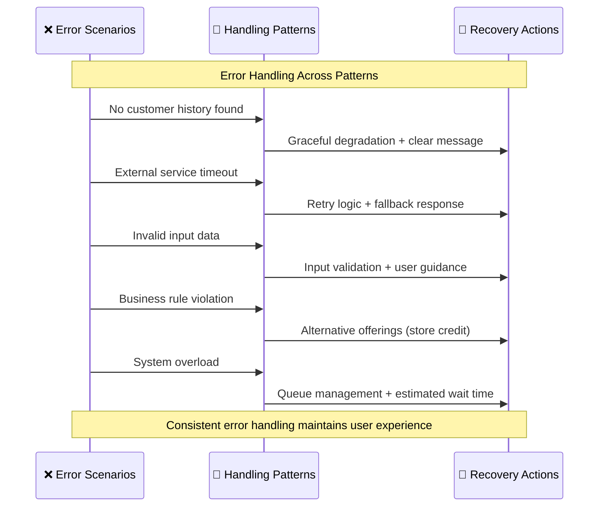

Esta documentação de sequência fornece uma visão detalhada das interações entre componentes, permitindo entender o timing, dependencies e fluxo de dados em cada padrão arquitetural do sistema de reembolso Natura.
