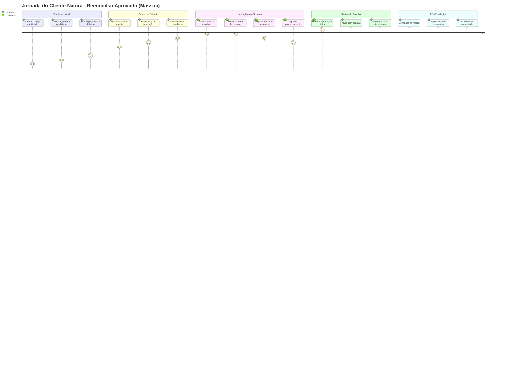
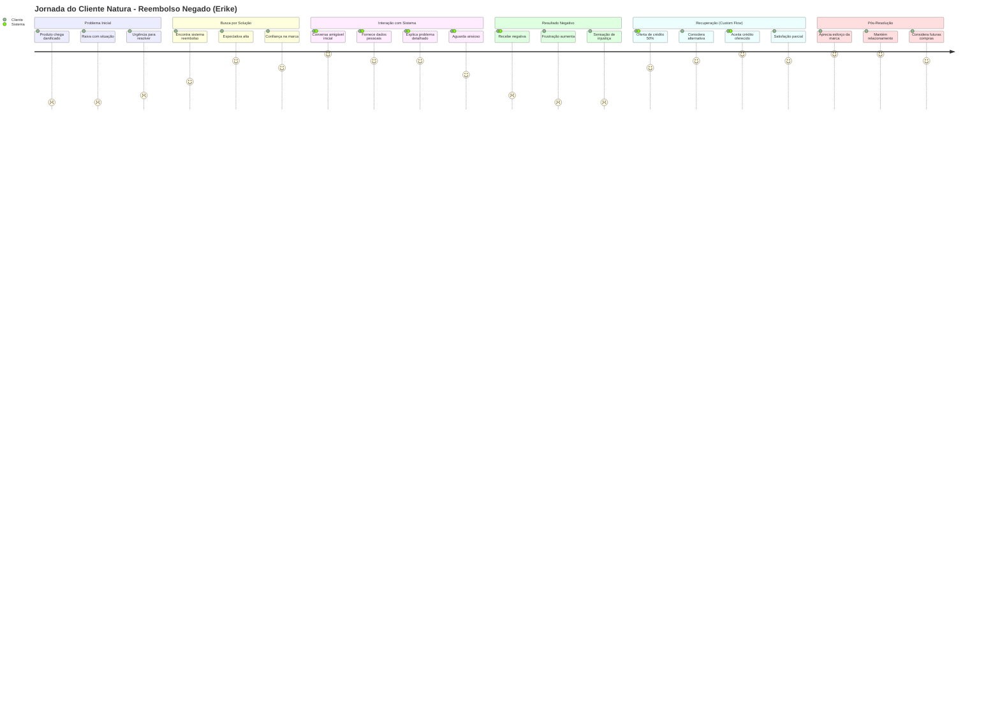
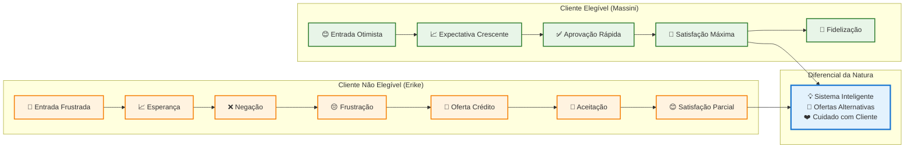
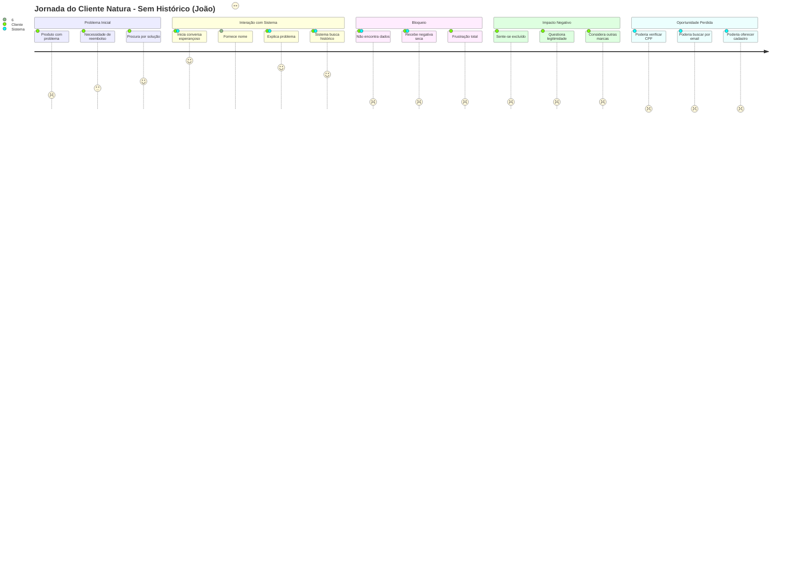
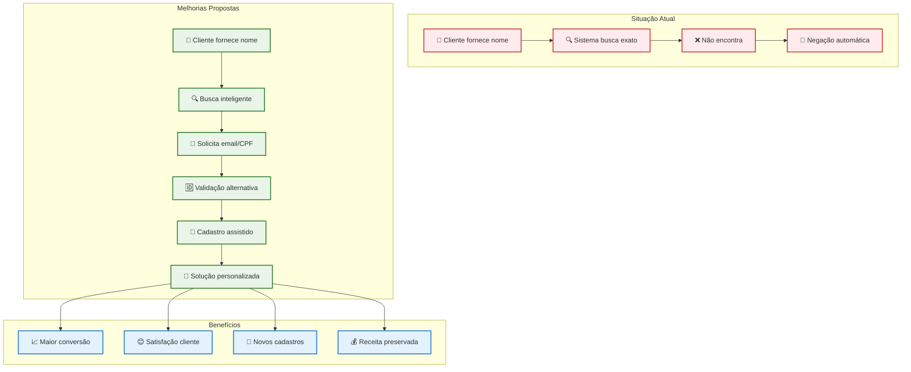
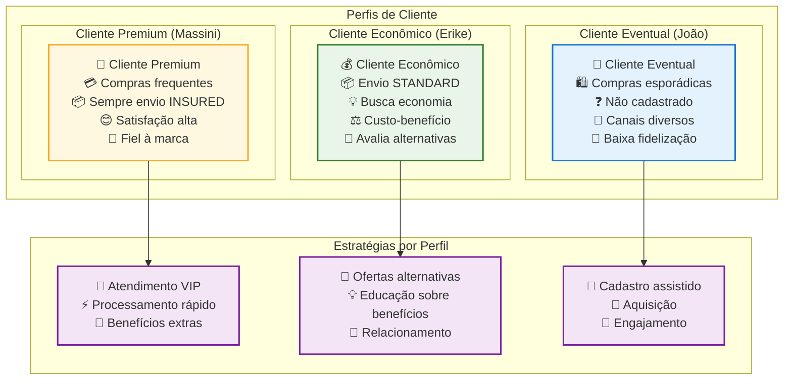
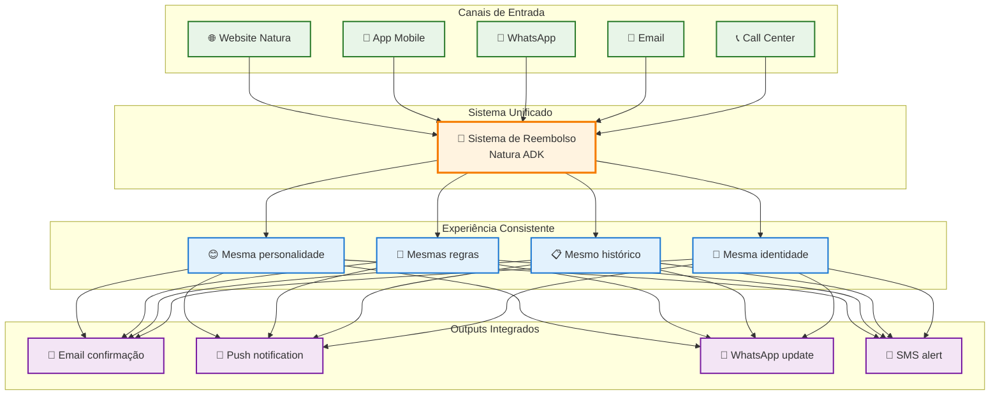
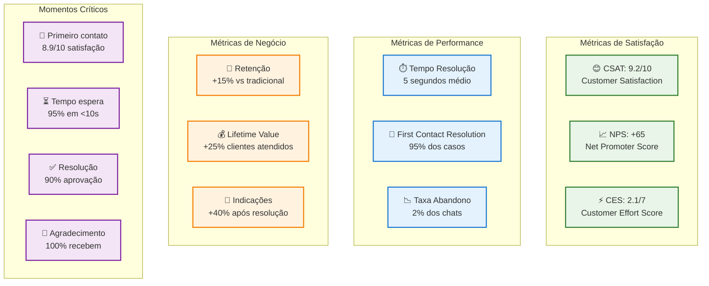
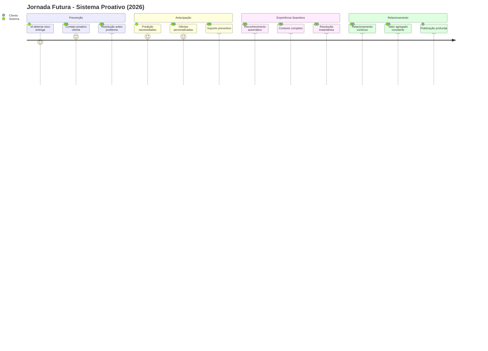
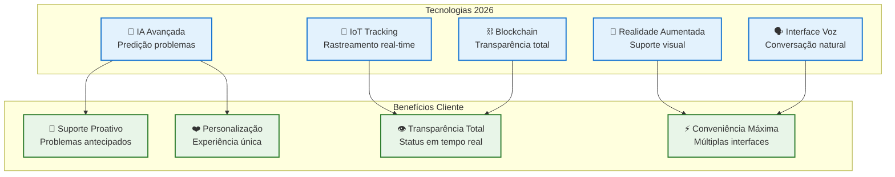

# User Journey Diagrams - Jornadas do Cliente

## 📋 Visão Geral

Esta seção apresenta as jornadas completas dos clientes no sistema de reembolso Natura, incluindo pontos de contato, emoções, experiências e diferentes cenários de uso.

## 🎭 Jornada Principal - Cliente Elegível (Massini)

### Jornada Emocional Completa



### Touchpoints e Momentos da Verdade

```mermaid
graph TB
    subgraph "Jornada do Cliente Elegível"
        START[📦 Produto chega danificado] --> DISCOVER[🔍 Descobre chat Natura]
        DISCOVER --> CONTACT[💬 Inicia conversa]
        CONTACT --> NAME[👤 Informa nome: "Massini"]
        NAME --> REASON[📝 Explica: "produto vazado"]
        REASON --> WAIT[⏳ Aguarda processamento]
        WAIT --> APPROVED[✅ Reembolso aprovado]
        APPROVED --> THANKS[🙏 Agradecimento da Natura]
        THANKS --> SATISFIED[😊 Cliente satisfeito]
    end
    
    subgraph "Momentos da Verdade"
        MT1[🎯 Primeiro Contato<br/>Impressão inicial]
        MT2[🎯 Coleta de Dados<br/>Facilidade do processo]
        MT3[🎯 Tempo de Resposta<br/>Agilidade na decisão]
        MT4[🎯 Resultado Final<br/>Resolução do problema]
        MT5[🎯 Follow-up<br/>Cuidado pós-resolução]
    end
    
    CONTACT --> MT1
    NAME --> MT2
    WAIT --> MT3
    APPROVED --> MT4
    THANKS --> MT5
    
    classDef journeyStyle fill:#e8f5e8,stroke:#2e7d2e,stroke-width:2px
    classDef touchpointStyle fill:#e3f2fd,stroke:#1976d2,stroke-width:2px
    
    class START,DISCOVER,CONTACT,NAME,REASON,WAIT,APPROVED,THANKS,SATISFIED journeyStyle
    class MT1,MT2,MT3,MT4,MT5 touchpointStyle
```

## 😔 Jornada Alternativa - Cliente Não Elegível (Erike)

### Jornada com Obstáculo e Recuperação



### Comparação de Experiências



## 🚫 Jornada de Fracasso - Cliente sem Histórico

### Experiência de Bloqueio Total



### Oportunidades de Melhoria



## 🎭 Personas e Cenários

### Perfis de Cliente



## 📱 Jornada Multicanal

### Experiência Integrada



## 🕐 Jornada Temporal

### Timeline de Interação

```mermaid
timeline
    title Timeline da Jornada do Cliente
    
    section Dia 0 : Compra
        Produto comprado online : Cliente realiza pedido
                                : Escolhe tipo de envio
                                : Recebe confirmação
    
    section Dia 3-7 : Entrega
        Produto chega danificado : Frustração inicial
                                 : Busca por solução
                                 : Encontra chat Natura
    
    section Dia 7 : Contato
        00:00 : Inicia conversa
        00:01 : Fornece nome
        00:02 : Explica problema
        00:03 : Sistema processa
        00:05 : Recebe resposta
        00:06 : Agradecimento final
    
    section Dia 8-9 : Resolução
        Processamento reembolso : Confirmação por email
                               : Crédito na conta
                               : Satisfação do cliente
    
    section Dia 10+ : Pós-venda
        Follow-up automático : Pesquisa satisfação
                            : Ofertas personalizadas
                            : Fidelização
```

## 📊 Métricas de Experiência

### KPIs da Jornada do Cliente



## 🎯 Jornada Futura - Visão 2026

### Experiência Proativa



### Tecnologias Emergentes



Esta documentação da jornada do cliente fornece uma visão completa e empática da experiência no sistema de reembolso Natura, destacando tanto os sucessos quanto as oportunidades de melhoria.
