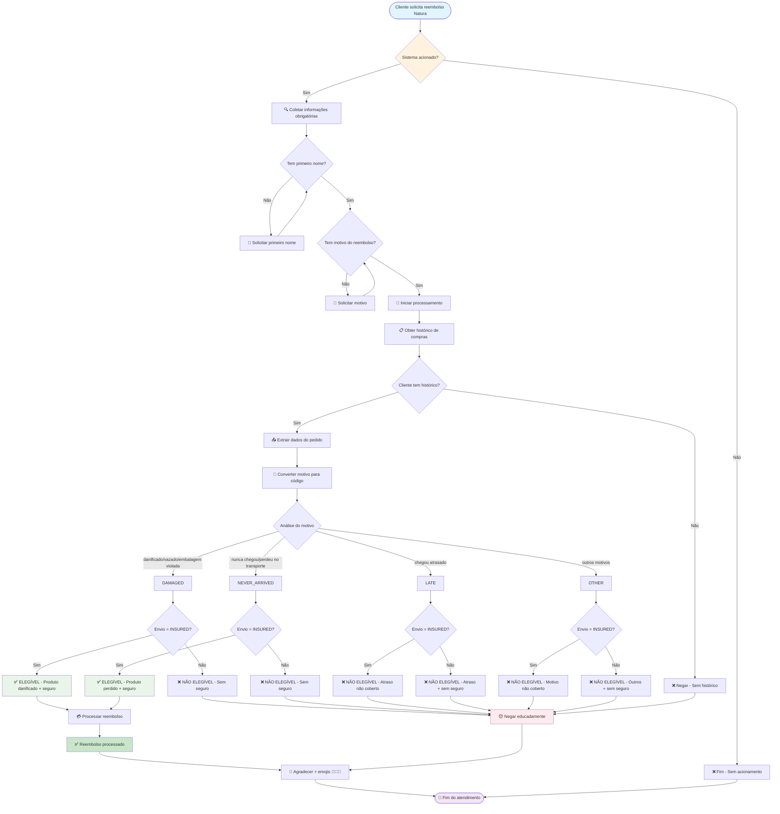

# Fluxo de Decisão - Sistema de Reembolso Natura

## 📊 Diagrama de Decisão Completo



## 🔍 Explicação Detalhada do Fluxo

### 1. Acionamento do Sistema
- **Trigger**: Cliente menciona palavras-chave relacionadas a reembolso
- **Verificação**: Sistema determina se deve processar a solicitação

### 2. Coleta de Informações Obrigatórias

#### 2.1 Primeiro Nome do Cliente
- **Obrigatório**: Sim
- **Formato**: String simples
- **Validação**: Normalização com `strip().title()`
- **Usado para**: Busca no histórico de compras

#### 2.2 Motivo do Reembolso
- **Obrigatório**: Sim
- **Formato**: Texto livre do cliente
- **Processamento**: Convertido para código padronizado

### 3. Verificação de Histórico de Compras

#### 3.1 Busca no Banco de Dados
```python
def get_purchase_history(purchaser: str) -> List[Dict[str, Any]]
```

#### 3.2 Dados Incluídos
- `order_id`: ID único do pedido
- `date`: Data da compra
- `items`: Lista de produtos comprados
- `shipping_method`: Método de envio (STANDARD/INSURED)
- `total_amount`: Valor total

#### 3.3 Casos de Não Encontrado
- **Resultado**: Lista vazia `[]`
- **Ação**: Negação educada do reembolso

### 4. Conversão de Motivos

| Descrição do Cliente | Código Sistema | Elegível? |
|---------------------|----------------|-----------|
| Produto danificado, vazado, embalagem violada | `DAMAGED` | ✅ Se INSURED |
| Nunca chegou, perdeu no transporte | `NEVER_ARRIVED` | ✅ Se INSURED |
| Chegou atrasado | `LATE` | ❌ Sempre |
| Não gostei, outros motivos | `OTHER` | ❌ Sempre |

### 5. Verificação de Elegibilidade

#### 5.1 Critérios Obrigatórios
```python
ELIGIBLE_SHIPPING_METHODS = ["INSURED"]
ELIGIBLE_REASONS = ["DAMAGED", "NEVER_ARRIVED"]
```

#### 5.2 Lógica de Decisão
```python
is_eligible = (
    shipping_upper in ELIGIBLE_SHIPPING_METHODS and 
    reason_upper in ELIGIBLE_REASONS
)
```

### 6. Processamento Final

#### 6.1 Se Elegível
1. **Função**: `process_refund(amount, order_id)`
2. **Geração**: ID único do reembolso
3. **Formato**: `REF-{order_id}-{amount*100}`
4. **Mensagem**: Confirmação com prazo (2 dias úteis)

#### 6.2 Se Não Elegível
1. **Mensagem**: Negação educada
2. **Explicação**: Sem detalhes técnicos dos critérios

### 7. Finalização do Atendimento

#### 7.1 Agradecimento
- **Sempre**: Agradecer por ser cliente Natura
- **Emojis**: 💄 ✨ 🌿 (relacionados à beleza/natureza)

#### 7.2 Encerramento
- **Log**: Registro completo da interação
- **Estado**: Sessão finalizada

## ⚠️ Observações Importantes

### Discrepância de Códigos
- **Prompts mencionam**: `LOST`
- **Código implementa**: `NEVER_ARRIVED`
- **Recomendação**: Padronizar para `NEVER_ARRIVED`

### Segurança de Dados
- **Logging**: Não expor dados sensíveis
- **Validação**: Sempre normalizar inputs do usuário
- **Consistência**: Manter formato padrão de resposta

### Tratamento de Erros
- **Histórico não encontrado**: Mensagem clara
- **Dados incompletos**: Solicitação de informações faltantes
- **Processamento falhou**: Mensagem de erro genérica

## 🧪 Casos de Teste

### Caso 1: Reembolso Aprovado (Massini)
```
Nome: Massini
Motivo: "Produto chegou danificado"
Resultado: ✅ Elegível (INSURED + DAMAGED)
```

### Caso 2: Reembolso Negado (Erike)
```
Nome: Erike
Motivo: "Produto chegou danificado"
Resultado: ❌ Não elegível (STANDARD ≠ INSURED)
```

### Caso 3: Cliente Inexistente
```
Nome: "João"
Resultado: ❌ Sem histórico de compras
